# OENG1168 Assignment 2 2021: Final Report FPGA-based video mixer project


Student: **Robert D Jordan S3136906**
Supervisor: **Dr Glen Mathews**

Acknowledgements:
**Lars Larson** (LZX Industries)
**Ed Leckie**

# Executive summary

#### Introduction

In the research landscape there is a lack of study or documentation
focused on the creation of a digital video mixer designed for the
entertainment and events industry. This creates the need for a project
focused on both the technical realisation of video mixer elements, as
well as the integration of these elements into a single functional
product. In this project an FPGA-based approach was selected as it
allows for iterative design development at low cost. The project uses
the Arty Z7: APSoC Zynq-7000 Development Board from Digilent \[1\]
utilizing the Zynq-7000 SoC \[2\] (Fig 1). This development board was
selected due to existing examples of video applications for the
platform, built-in HDMI ports, and the presence of a hard processor on
silicon.

#### Methodology

This project follows a novel method for development based around the
'On/Off Ramp' method. In this method, branching paths from key
milestones create more confidence of completion through a flexible
design specification. Within each of the key milestones, we followed an
iterative design cycle approach consisting of research, development,
testing and integration of smaller tasks within the overall goal.

#### Test pattern generator

A test-pattern generator with 13 colour test patterns was designed,
built, tested, and deployed to hardware before being integrated into the
final design. These 13 test patterns include a range of colours and
geometric patterns and are used to demonstrate the alpha blender
functionality of the video mixer.

#### Pixel-wise effects

Five visual effects were designed, built, tested, and deployed to
hardware before being integrated into the final design, with several
additional effects developed (but not integrated) into the final design.
These visual effects transform the live incoming video in an
aesthetically pleasing fashion.The HDL designs of these effects perform
well when compared to the mathematical ideal that they derive from.

#### Alpha blender

A 10-bit RGB alpha blender was designed, built, tested, and deployed to
hardware before being integrated into the final design. This module
allows for the alpha blending or mixing of two digital video sources (a
live DVI video source and the test-pattern generator).

#### Auto-fade

An auto-fade module was designed, built, tested, and deployed to
hardware.

#### Interface

A USB UART interface to the alpha blender, test pattern generator and
effects was designed, built, tested, and deployed to hardware before
being integrated into the final design. This design accepts a range of
ASCI commands which it translates to hardware registers via a Xilinx AXI
GPIO IP block. Through this interface test patterns may be selected,
alpha blend position set, and individual effects turned on and off.

#### Conclusion

Developing custom video hardware on FPGA presents a range of challenges.
However, the relatively low cost, high availability of technical
resources and customizable nature of this technology, alongside the huge
potential for parallel processing positions it as a clear choice for
this kind of work over similarly positioned multimedia processors or
general computing systems. This report documents and illustrates some of
the key developments in creating a two-channel digital video mixer
designed for the entertainment industry, along with integrating these
elements into a final working design deployed on hardware.

# Contents {#contents .TOC-Heading}

[Executive summary 2](#executive-summary)

[Glossary of Commonly Used Terms 6](#glossary-of-commonly-used-terms)

[Introduction/Statement of the Problem
7](#introductionstatement-of-the-problem)

[Aims and Achievements 7](#aims-and-achievements)

[Background and Literature Review 8](#background-and-literature-review)

[Methodology/Design and Justification
10](#methodologydesign-and-justification)

[Software and Hardware 10](#software-and-hardware)

[Software 10](#software)

[Hardware 10](#hardware)

[Design Methodology: 10](#design-methodology)

[Simulation Challenges and Solutions
11](#simulation-challenges-and-solutions)

[Test/debug: 12](#testdebug)

[Deployment 14](#deployment)

[Development process 16](#development-process)

[The ON/OFF Ramp Model 16](#the-onoff-ramp-model)

[Timeline 17](#timeline)

[Iterative Development 18](#iterative-development)

[Findings 19](#findings)

[System Design 19](#system-design)

[DVI Video Input and Output 19](#dvi-video-input-and-output)

[DVI to RGB 20](#dvi-to-rgb)

[RGB to DVI 20](#rgb-to-dvi)

[Physical connections 20](#physical-connections)

[The IP Core's Role in Test, Development, and Debug
21](#the-ip-cores-role-in-test-development-and-debug)

[Test Pattern Generator 21](#test-pattern-generator-1)

[Description 21](#description)

[Block Diagram 21](#block-diagram)

[Implementation 21](#implementation)

[Patterns 22](#patterns)

[Summary and Reflection 23](#summary-and-reflection)

[Pixel-wise Effects 23](#pixel-wise-effects-1)

[Metrics for Success 23](#metrics-for-success)

[Description 26](#description-1)

[Pixel-wise Effects System Design 26](#pixel-wise-effects-system-design)

[List of Implemented Video Effects
27](#list-of-implemented-video-effects)

[Mixer/Alpha Blender 34](#mixeralpha-blender)

[Description 34](#description-7)

[Implementation 35](#implementation-4)

[Summary and Reflection 36](#summary-and-reflection-6)

[Auto-fade 36](#auto-fade-1)

[Description 36](#description-8)

[Implementation 37](#implementation-5)

[State Machine diagram 38](#state-machine-diagram)

[Debugging 38](#debugging)

[Summary and Reflection 39](#summary-and-reflection-7)

[Hard Processor Control 39](#hard-processor-control)

[PS to PL bridge using AXI 39](#ps-to-pl-bridge-using-axi)

[UART control 40](#uart-control)

[Additional Exploration 43](#additional-exploration)

[Second HDMI Input 43](#second-hdmi-input)

[Second HDMI Output 44](#second-hdmi-output)

[Resource Utilisation 44](#resource-utilisation)

[Deployed Design 46](#deployed-design)

[Summary and Discussion 46](#summary-and-discussion)

[Recommendations and Future Work 47](#recommendations-and-future-work)

[Frame Buffer 47](#frame-buffer)

[Additional Pixel-wise Effects and Mixing Modes
47](#additional-pixel-wise-effects-and-mixing-modes)

[TCP/IP and UDP control 47](#tcpip-and-udp-control)

[Physical User Interface 48](#physical-user-interface)

[Organisation and Time Management 48](#organisation-and-time-management)

[Conclusion 48](#conclusion-2)

[References 50](#references)

[Appendix 55](#appendix)

[Appendix 1: Milestone Timeline 55](#appendix-1-milestone-timeline)

[Appendix 2: ON/OFF RAMP 56](#appendix-2-onoff-ramp)

# Glossary of Commonly Used Terms

  ----------------------------------- -----------------------------------
  FPGA                                Field programmable gate array

  HDMI/DVI                            **H**igh-**D**efinition
                                      **M**ultimedia
                                      **I**nterface/**D**igital **V**ideo
                                      **I**nterface

  Video Mixer/Vision Switcher         A device for blending multiple
                                      video signals together in real-time

  HDL                                 **H**ardware **D**escriptive
                                      **L**anguage; a specialized
                                      computer language used to describe
                                      the operation of digital logic
                                      circuits

  PL                                  **P**rogrammable **L**ogic; the
                                      FPGA architecture

  PS                                  A hard processor

  IP / IP block / IP Core             IP refers to Intellectual Property
                                      modules written in Verilog or VHDL.
                                      IP is a term for a module or block
                                      of HDL design.

  Synthesize                          The process of transforming a
                                      HDL-specified design into a
                                      gate-level representation.

  RTL                                 **R**egister-**T**ransfer **L**evel
                                      is a design abstraction which
                                      models a synchronous digital
                                      circuit in terms of the flow of
                                      digital signals (data) between
                                      hardware registers, and the logical
                                      operations performed on those
                                      signals.

  JTAG                                JTAG (named after the **J**oint
                                      **T**est **A**ction **G**roup which
                                      codified it) is an industry
                                      standard for verifying designs and
                                      testing printed circuit boards
                                      after manufacture

  AXI                                 **A**dvanced e**X**tensible
                                      **I**nterface, a parallel
                                      high-performance, synchronous,
                                      high-frequency, multi-controller,
                                      multi-agent communication
                                      interface, mainly designed for
                                      on-chip communication.

  ACP                                 **A**ccelerator **C**oherency
                                      **P**ort. An interface enabling
                                      coherent accesses from PL to CPU
                                      memory space
  ----------------------------------- -----------------------------------


#  Introduction/Statement of the Problem

Real-time video processing is a field with a well-established history of
research and development \[3\] but practical hardware implementations
are often kept private by companies as part of commercialisation efforts
\[4\]. When detailed implementations are made public through academia or
open-source projects, they are often only subsections of systems or
processes presented independently of hardware realisation \[5\] with
\[6\] being the exception dedicating one of fourteen chapters to this.
There have been few documented explorations that bring together
disparate solutions to form a cohesive functional video-mixer. This
project seeks to fill this knowledge-gap documenting how to develop a
holistic Field programmable gate array (FPGA) based solution to building
a hardware video mixer.

Rapid growth of the entertainment and live video streaming industries
and the importance of real-time hardware video mixers to this industry
make this project particularly timely. Historically, much research in
real-time video processing has been in the fields of robotics,
self-driving cars, computer vision and 3D graphics processing \[7\].
Comparatively little is dedicated to the entertainment industry, which
has seen year-on-year growth, particularly in live streaming \[8\] with
continued growth in Esports \[9\], YouTube \[10\] and other similar live
video platforms. These developments have been shown to have an impact
outside of the entertainment industry \[11. Real-time hardware video
mixers form a significant proportion of the global presentation switcher
market which is predicted to grow by 8.64% between 2019 and 2027 \[12\].
With the growth and impact of this industry in mind, this is an
important and exciting space to be researching.

There is little research documenting the practical implementation of
hardware solutions in the field of real-time video processing. This
project seeks to bridge that gap by fusing the high-level, whole-system
thinking of building and documenting a video mixer with the low-level
specificity of how this might be executed technically.

## Aims and Achievements

**The aim of this capstone project is to build and document a
two-channel video mixer on an FPGA.**

This project aims to document the creation of a hardware video
processing tool through the implementation of a two-channel digital
input video mixer with an overlay based around the Arty Z7: APSoC
Zynq-7000 \[1\] utilising the Zynq-7000 SoC \[2\], an SoC capable of
real-time video processing \[13\] (Fig. 1). This project will make use
of Xilinx's Vivado and Vitas IDEs for programming, simulation and
debugging. FPGAs are an attractive choice for video hardware development
because of their recently decreasing costs, increasing developer support
and adoption \[14\] and processing power. The process of developing this
hardware will be documented through visual diagrams, text, code
snippets, simulation, and photography.

The specific aims of this project are to:

-   Mix two digital video sources in real-time using an FPGA (one
    DVI/HDMI input, one internally generated)

-   Perform simple aesthetic effects or transformations to the video
    output

-   Control mixing and effects via an interface (physical or digital)


# Background and Literature Review

#### Context and Inspiration

The Sony Portapak was the first commercially available portable video
recorder that democratised the production of video content in the 1960s
and 1970s \[15\]. It demonstrated that making this type of technology
accessible to creative people could be a powerful driver of innovation
and initiate a rapid expansion of cultural aesthetics. This phenomenon
is further demonstrated when looking at the history of VJ (video jockey)
culture and the effect of accessible real-time video effects/processing
hardware on visual aesthetics and visual culture globally \[16\]. This
project draws considerable inspiration from existing video mixers in its
design and feature-set, including the seminal Edirol (now Roland) V
series (V4\[17\], V8\[18\], V4ex\[19\], V1HD \[20\]).

#### FPGA

As discussed in previously, FPGAs are an increasingly attractive choice
for developing video hardware. However, a known shortcoming in pure FPGA
hardware is the lack of a closely integrated, hard processor designed to
handle control, communication and other key tasks usually assigned to
sequential processors. Whilst soft CPU cores are possible within an FPGA
only solution, they occupy a large amount of the valuable FPGA fabric
and require significant amounts of work in terms of creating peripherals
and integrating with the rest of the design. Xilinx and Altera (now
Intel) have offered effective solutions to this problem by creating
FPGAs with capable application hard processors on the same silicon
fabric \[21\]\[22\]. This offers a high level of integration and
connectivity to designers who ideally will be able to use the FPGA side
for its strengths in parallelization and high-speed DSP, and use the
application processor for its strengths in areas such as network
communication and RTOSs.

For this project I chose to use the Arty Z7 for its built-in HDMI ports
and existing compatible video IP from both Xilinx and Digilent.

#### Simulation and Debugging

Testing and simulation is a crucial part of the FPGA development cycle
as it allows a developer to test code without time-consuming routing,
bitstream generation, deployment, or debug setups. The modules were
initially developed and simulated in MATLAB \[23\] before being created
and tested in Xilinx\'s Vivado simulator \[24\]. This software is
capable of simulation using testbenches programmed using TCL or
procedural Verilog \[25\].

Several visualisers were tested in Vivado \[26\]\[27\] as well as a
real-time Verilator \[28\] test setup 8bitworkshop \[29\]. However,
these methods proved to be less convenient than the combination of
Vivado's build in simulator and the MATLAB visualiser. This was due to
the low overhead in visualising the output in MATLAB along side MATLAB's
extensive set of image analysis tools \[23\].

#### DVI/HDMI input

Xilinx has a proven history with video in the broadcast space \[22\]
allowing implementation of HDMI \[30\] and DVI \[31\] (through HDMI
backwards compatibility) video interfaces through their IC's TMDS pins
\[32\]\[33\] offering licensed IP blocks \[34\]. There exist, however,
several free and open-source video input solutions for FPGA covering
HDMI \[35\] and DVI \[36\] as well as several examples and demos from
Digilent specific to the selected development board \[37\]. For this
project the Digilent DVI2RGB IP \[38\] was used because it was designed
for the ARTY Z7.

#### DVI/HDMI output 

As with video input, Xilinx TMDS pins allow for simple digital video
output without the need for external video encoder ICs. Because of this,
several HDMI and DVI output projects exist for Xilinx FPGAs
\[39\]\[40\]\[41\] which are both modular in design and hardware
agnostic (for Xilinx devices) in their implementation. For this project
the Digilent RGB2DVI IP was used \[42\] because it was designed for the
ARTY Z7.

#### Video Effects 

While many resources exist for image transformations such as scaling
(achieved via filtering \[43\] or through linear interpolation \[44\])
or kernel operations such as blur or sharpen (via finite impulse
response filtering \[45\]), few exist for the realisation of aesthetic
image effects. Substantial background and direction in this project came
from Video/Image Processing on FPGA \[46\] and Image Processing Using
FPGAs \[6\].

#### Image Storage and Retrieval

The Arty Z7 features both 512MB DDR3 RAM with 16-bit bus @ 1050Mbps and
DDR3 RAM memory controller with eight DMA channels and four
high-performance AXI3 ports built into the Zinq ASoC \[2\]. This makes
the device capable of the video frame storage and retrieval needed for
video mixing. The DDR3 RAM controller is accessible from the ASoC
directly \[47\] and may be accessed from the programmable logic (FPGA
fabric)) via High-Performance AXI ports \[48\] if correctly configured
in hard processor memory. Relatively few resources exist for how to
utilise the DDR3 memory on the ARTY Z7, but Digilent offers two existing
demo projects that make use of the DDR3 RAM memory as a frame buffer
through the ASoC \[37\]. This feature provided the most substantial
stumbling-block for the project, detailed later in the report.

#### Mixing/blending

Compositing images is a well-established field with well-regarded papers
on combining images in an aesthetically pleasing manner. Mixing,
switching, and wiping may all be achieved with a single technique often
referred to as alpha compositing \[49\]\[50\]. Whilst a wide number of
mixing and blending modes exist (including multiply, screen, overlay)
and a wide number of arithmetic modes (such as divide and difference)
\[51\]\[52\], implementing these blending modes was outside the scope of
this project.

# Methodology/Design and Justification

## Software and Hardware

### Software

-   Xilinx Vivado (version)\[53\], an integrated development environment
    (IDE) for Xilinx FPGAs featuring code editor, synthesizer, debugger,
    simulator, implementor, bitstream generator and programmer/device
    manager.

-   Xilinx Vitis (version)\[54\], an IDE for developing, debugging, and
    deploying software for the PS side of Xilinx FPGA platforms.

-   MathWorks MATLAB (version)\[23\], a programming and numeric
    computing platform commonly used in engineering education.

### Hardware

-   Arty Z7: APSoC Zynq-7000 Development Board from Digilent \[1\],
    specifically the Arty Z720 variant, utilizing the Zynq-7000 SoC
    \[2\] (Fig 1).

```{=html}
<!-- -->
```
-   HDL development was performed on a Lenovo ThinkPad T480 laptop with
    an Intel Core i7-8550U CPU @ 1.80GHz, 1992 MHz, 4 Core(s) with 16GB
    of RAM.

```{=html}
<!-- -->
```
-   Gatan GA1062 60Mhz oscilloscope

```{=html}
<!-- -->
```
-   Unbranded 24Mhz USB logic analyser with the compatible Pulse view
    software \[55\]

## Design Methodology:

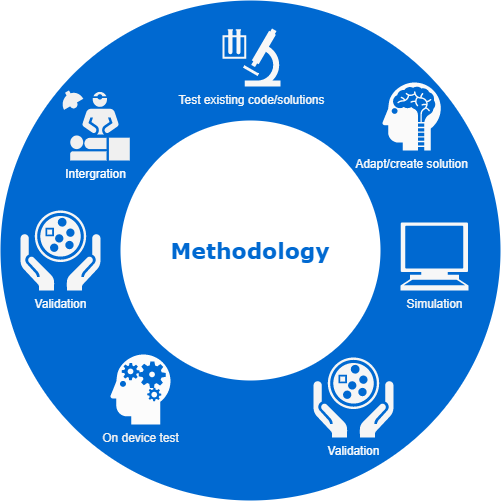{width="2.7239588801399823in"
height="2.7239588801399823in"}

Figure 2. Methodology process for each milestone

The development of each key feature followed this process (fig. 2).

1.  **Test and evaluate** existing open-source code and solutions
    gathered in previous reports \[56\]

2.  **Adapt existing code or create original code** to create a solution
    to the key feature

3.  **Simulate** the solution, revising the code until satisfactorily
    tested using the Vivado built-in simulator

4.  **Complete an on-device test** of implementation and operation to
    identify potential issues such as constraints or timing violations

5.  **Validate** the solution against the requirements of the key
    feature and the goals of the project

6.  **Test and debug** the feature on the device, revising design as
    necessary using the methods described below

7.  **Validate** the solution against the requirements of the key
    feature and the goals of the project

8.  **Integrate** key features into the project

### Simulation Challenges and Solutions

#### Vivado Built-in Simulator

Simulation of Verilog and VHDL was performed via the Vivado built-in
simulator using test benches written in behavioural Verilog \[57\].
Whilst the simulation of HDL is a simple and intuitive process in this
simulator, video hardware designs produce a huge amount of simulated
data points often not best understood through the waveform display of a
simulator. This was a key challenge for this project and made working
with video more complex than another similar scale FPGA project might
have been.

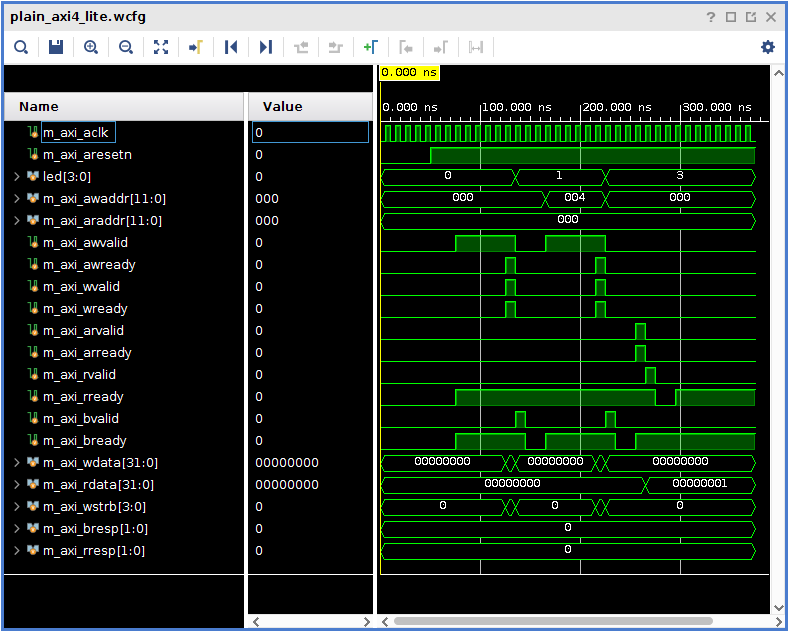{width="3.15625in" height="2.5286384514435696in"}

Figure 3. Vivado Simulator

To address the issue of understanding large numbers of simulated data
points representing visual information, a MATLAB script was created to
translate the raw output of the Vivado simulator to a visual image
capable of being examined and operated on using the inbuilt tools
available in MATLAB.

#### MATLAB Visualiser Script

For the task of visualising Vivado simulator output in a raw
uncompressed form, a custom script was written in MATLAB. This was
particularly valuable because much of the validation work for this
project involved comparing the output of the design in different states,
such as with a pixel-wise effect enabled or not. This custom script was
designed to be resolution agnostic to handle a range of resolutions
(including nonstandard resolutions) without the need to define the image
resolution within the code.

{width="6.5in"
height="0.9118055555555555in"}

Figure 4. MATLAB script structure

The custom script takes exported simulator data, stored as CSV format in
a .txt file and extracts the pixel and timing information before
reconstructing it as an unformatted, uncompressed RGB image. Note, the
black areas around the output image (top, left and bottom) (figure 5)
are due to blanking periods of the generated signal, whilst the extended
black area on the right is a combination of the blanking period and a
string of pixels that is output before the first horizontal sync pulse.
These blanking periods are not present in the final video output, but
this issue with the simulation data should be addressed in future
research, in either the simulator test bench or the MATLAB script.

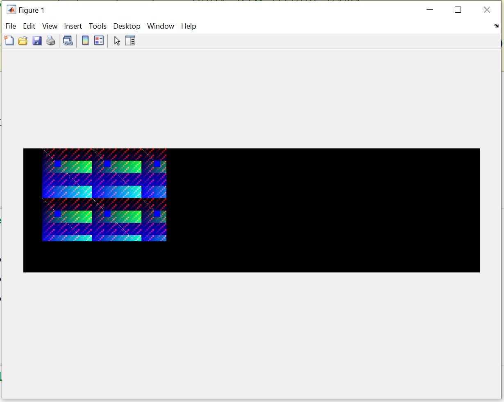{width="3.0835083114610673in"
height="2.466806649168854in"}

Figure 5. MATLAB script output

### Test/debug:

Once running on an FPGA, a video hardware design becomes increasingly
difficult to test and debug. Without the ability to probe the
interconnects between components as we can in traditional IC-based
hardware design, alternative solutions must be sought.

#### Test LEDs

The four LEDs (fig. 6) and two RGB LEDs on the Arty Z7 are valuable for
simple debugging, and sense checking RTL code running on the board. The
low overhead in terms of resource utilisation (often as low as a single
buffer and I/O pin) and low time required to implement this method are
hugely advantageous when compared to methods such as Integrated Logic
Analyzer (ILA) or a custom debug solution using the PS core or
JTAG-to-AXI (AXI debug interface).

During the development of this project, these LEDs were used to:

1.  Confirm the operation of slow speed clocks such as the pixel clock
    and auto-fade clock

2.  Confirm the state of the auto-fade state machine

3.  Confirm the locked status of the Clock Wizard IP block

4.  Confirm the status of various flags used across a variety of IP
    blocks

5.  Confirm the operation of the AXI-GPIO module and its connection to
    the hard processor

#### PMOD Ports

For situations where more detail was required than confirming that a
clock was running or a flag being toggled, the built-in PMOD ports of
the Arty Z7 were used to break out internal signals to an oscilloscope
or logic analyser.

During the development of this project, the PMOD port was used to:

1.  Verify the frequency of horizontal and vertical sync of the output
    signal as well as the pixel clock and blanking periods

2.  Verify the operation of internal counters such as the 'step counter'
    found within the auto-fade IP and the AXI-GPIO module

+-----------------------------------+-----------------------------------+
| {width="2.4243744531933507in" | jpg){width="3.1041666666666665in" |
| height="2.4687773403324584in"}    | height="2.3333333333333335in"}    |
|                                   |                                   |
| Figure 8. Logic analyser debug    | Figure 9. Oscilloscope debug      |
| setup                             | setup                             |
+-----------------------------------+-----------------------------------+

: Table 2: Test-Patterns

#### Xilinx Integrated Logic Analyser 

Xilinx integrated logic analyser (ILA) \[58\] was used for probing buses
and signals that were either too wide to be represented on the Arty Z7's
LEDs or too high frequency to be debugged by probing the PMOD port.
Although unfortunately, the significant time taken to synthesise the
Xilinx debug IP on the low-powered computer used for development made it
impractical to use unless absolutely required, for example, while
working on the auto-fade module.

The Xilinx ILA operates by inserting an RTL debugging core connected to
the JTAG interface and a probe IP connected to the design under test.
Once implemented, Vivado's device manager detects the debug core and
displays its probes in a dashboard. The ILA was implemented using the
Debug Wizard found in Vivado's synthesis/debug window.

One of the discoveries made during the development process was that
because the pixel clock drives the ILA clock in this design, there needs
to be a valid video input to activate the debug core and make it visible
to the device manager.

### Deployment

To allow a simple environment for deploying and visually confirming the
operation of the project at various steps, two deployment setups were
used (Figures 10 & 11).

+-----------------------------------+-----------------------------------+
| {width="3.1041666666666665in" | jpg){width="3.1041666666666665in" |
| height="2.351917104111986in"}     | height="2.3333333333333335in"}    |
|                                   |                                   |
| Figure 10a. Test setup one        | Figure 11a. Test setup two        |
| (photo)                           | (photo)                           |
+-----------------------------------+-----------------------------------+
| {width="3.1041666666666665in" | 12.png){width="2.8691447944007in" |
| height="0.7222222222222222in"}    | height="1.5019685039370079in"}    |
|                                   |                                   |
| Figure 10b. Test setup one        | Figure11b. Test setup two         |
| (schematic)                       | (schematic)                       |
+-----------------------------------+-----------------------------------+

: Table 3: Invert input/output

Initially, test setup one was used for development, however, the camera
took too long to complete its EDID handshake with the FPGA, which slowed
down how quickly the test and debug could be completed. Test setup two
was a further iteration of the first setup and used for most of the
development process, as it was a faster more responsive system. This was
due to the fast resolution detection of the Mac Mini and both the wide
range of accepted resolutions from the Dell monitor in addition to its
forgiving nature regarding pixel clock frequency and other timings. This
was important while in development because experimenting with designs
often caused variations in clock frequency that could subsequently be
gracefully handled.

#### Xilinx Deployment Process

Deployment to the Arty Z7 using the Xilinx toolchain \[ref\] for PL-only
designs, in Vivado:

1.  HDL creation (Verilog/VHDL)

2.  Out of context module synthesis

3.  Project synthesis

4.  Project implementation

5.  Bitstream generation

6.  Bitstream upload

Deployment to the Arty Z7 using the Xilinx toolchain \[ref\] for PL/PS
designs, in Vivado:

1.  HDL creation (Verilog/VHDL)

2.  Out of context module synthesis

3.  Project synthesis

4.  Project implementation

5.  Bitstream generation

6.  Export hardware platform file

In Vitas:

7.  Import hardware platform file

8.  Compile C++ code

9.  Upload bundled code (bitstream and binary files) to FPGA

## Development process

### The ON/OFF Ramp Model

To undertake an ambitious project with many unknown factors and
potential complications a novel approach was taken to the development
process.

{width="5.864583333333333in"
height="3.056330927384077in"}

Figure 12. ON/OFF ramp model

The ON/OFF Ramp document for this project is demonstrated in Figure 14
(see Appendix 2 for enlarged version). This type of document lists a
chain of milestones to achieve the desired outcome but also considers
that unforeseen obstacles may prevent the final goal from being
achieved. To mitigate this risk, the ON/OFF Ramp model shows multiple
places at which the project may be adapted into a final solution,
despite such obstacles.

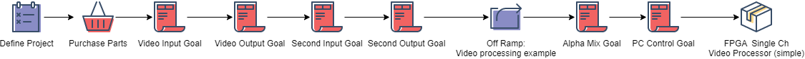{width="6.5in" height="0.48541666666666666in"}

Figure 12b. Project path

Difficulties with achieving the frame buffer goal caused this exit ramp
to be taken. It should be noted that further goals such as the second
input, second output and alpha blender were achieved, with the alpha
blender being integrated into the final design. There may be similar
types of documents found in project management, but an initial search
was unable to identify other planning documents that follow this
structure.

### Timeline

Table 1 lists the tasks and milestones outlined in 'ONEG1168 Assignment
1 2021: Completion Report' \[56\] and compares their completion date
with the predicted completion date. However, due to the flexible nature
of the project and the modular nature of the work, many tasks were able
to be undertaken simultaneously, and the exit ramp chosen for the
project changed some of the specifications.

+------------------------------+-----------------+---------------------+
| **TASKS:**                   | **Target Date** | **Actual Completion |
|                              |                 | Date**              |
+------------------------------+-----------------+---------------------+
| **Semester 1:**              |                 |                     |
+------------------------------+-----------------+---------------------+
| **Define Project**           | Feb 10th        | Feb 10^th^          |
+------------------------------+-----------------+---------------------+
| **Purchase parts**           | Feb 12th        | Feb 10^th^          |
+------------------------------+-----------------+---------------------+
| Xilinx\'s Vivado toolchain   | March 15th      | 1st March           |
| familiarity                  |                 |                     |
+------------------------------+-----------------+---------------------+
| Successfully run Digilent    | 11th April      | 10th March          |
| demos on hardware            |                 |                     |
+------------------------------+-----------------+---------------------+
| Successfully run Digilent    | 29th April      | 5th April           |
| demos on hardware/software   |                 |                     |
+------------------------------+-----------------+---------------------+
| Simulation and debug process | 16th June       | 29th April          |
| tested                       |                 |                     |
+------------------------------+-----------------+---------------------+
| **Semester 1-2 Break**       |                 |                     |
+------------------------------+-----------------+---------------------+
| **1.VIDEO INPUT GOAL**       | 28th June       | 28th June           |
|                              |                 |                     |
| Decode HDMI/DVI input        |                 |                     |
+------------------------------+-----------------+---------------------+
| **1.5 VIDEO EFFECTS**        | 20th July       | 20th July           |
+------------------------------+-----------------+---------------------+
| **Semester 2:**              |                 |                     |
+------------------------------+-----------------+---------------------+
| **2.VIDEO Output GOAL**      | 15th July       | 20th March          |
|                              |                 |                     |
| Encode HDMI/DVI input        |                 |                     |
+------------------------------+-----------------+---------------------+
| **3.Frame Buffer GOAL**      | 16th August     | 23rd August         |
|                              |                 |                     |
| Store and retrieve frame     |                 |                     |
| data in DDR3 RAM             |                 |                     |
+------------------------------+-----------------+---------------------+
| **4.Second Input GOAL**      | 9th August      | 15th April          |
|                              |                 |                     |
| Decode second HDMI/DVI input |                 |                     |
+------------------------------+-----------------+---------------------+
| **5.Second Frame Buffer      | 30th August     | N/A                 |
| GOAL**                       |                 |                     |
|                              |                 |                     |
| Store and retrieve frame     |                 |                     |
| data in DDR3 ram             |                 |                     |
+------------------------------+-----------------+---------------------+
| **6.Alpha Mixer GOAL**       | 13th September  | 1st August          |
|                              |                 |                     |
| Alpha blend between two      |                 |                     |
| frame buffers                |                 |                     |
+------------------------------+-----------------+---------------------+
| **7. Second Output GOAL**    | 30th September  | 1st April           |
|                              |                 |                     |
| Encode second HDMI/DVI input |                 |                     |
+------------------------------+-----------------+---------------------+
| **8. Custom Interface GOAL** | 18th October    | 1st Oct             |
|                              |                 |                     |
| Create an interface to       |                 |                     |
| control mixer features       |                 |                     |
+------------------------------+-----------------+---------------------+
| \*NOTE Numbered tasks are    |                 | Red = behind        |
| milestones outlined in       |                 | schedule            |
| ON/OFF ramp                  |                 |                     |
|                              |                 | Yellow = on         |
|                              |                 | schedule            |
|                              |                 |                     |
|                              |                 | Green = ahead of    |
|                              |                 | schedule            |
+------------------------------+-----------------+---------------------+

: Table 4: Channel Swap input/output

#### Reflection on Timeline

With the large amount of work undertaken in Semester One and a clearly
defined set of goals, many of the tasks and milestones defined in the
timeline were achieved ahead of schedule. The framebuffer, which was
identified in the completion report as a potential issue, proved
difficult to implement, and as such the test implementation achieved ran
behind schedule. Eventually, the frame buffer goal was not implemented,
and additional mixer features were implemented in place of this goal.

### Iterative Development

In line with the design methodology, the iterative development of this
project involved ideas and solutions being created and tested separately
before being integrated into the design. Below is a summary of the
iterative process followed on this project.

1.  **DVI out** functionality achieved

2.  **DVI through** functionality achieved

3.  **Pixel-wise effects** achieved independently then integrated into
    **DVI through**

4.  **AXI-GPIO** test achieved independently then integrated into **DVI
    through**

5.  **AXI-GPIO** connected to **pixel-wise effects** within **DVI
    through**

6.  **Alpha mixer** developed independently then integrated into **DVI
    out**

7.  **Test pattern** built into **DVI out** before being integrated into
    **DVI through**

8.  **Auto-fade** developed within **DVI through**

*Note: Items in **bold** above represent separate Vivado projects.*

# Findings

## System Design

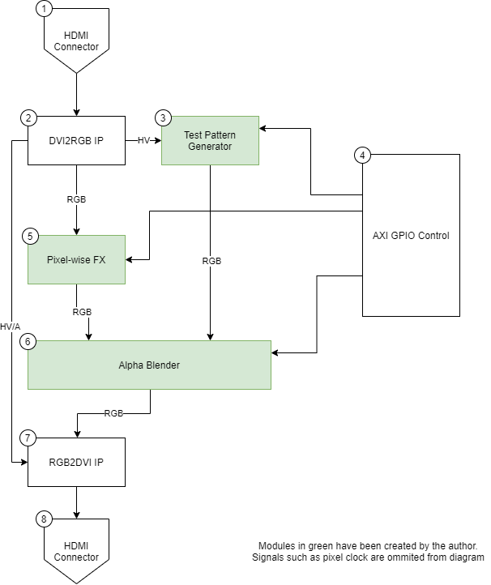{width="4.363451443569554in"
height="5.190510717410324in"}

Figure 13. System Design

The system design of this project takes the form of a simplified video
mixer where incoming DVI video (1) is decoded to RGB pixel format and
timing information by the DVI2RGB IP (2). It is then processed by
pixel-wise FX (5) and then mixed with a test pattern (3) using the alpha
blender (6). Finally, this combined and treated video is converted to
DVI data by the RGB2DVI IP (7) and sent out of the HDMI connector (8).
The test pattern generator (3), the pixel-wise effects (5) and the alpha
blender (6) are controlled via the ArtyZ7 USB UART using the AXI-GPIO
controller (4) to bridge the hard processor and programmable logic.

## DVI Video Input and Output

To meet the ambitious schedule for this project, existing IP for video
input and output were selected. Two IP cores (DVI to RGB and RGB to DVI)
from Digilent were used as the backbone of the project and were the
first elements to be implemented. These cores were selected due to their
availability, clear documentation, and support on Xilinx series 7 FPGAs,
specifically the Arty Z7.

### DVI to RGB

The Digilent DVI to RGB IP core \[38\] is a 24-bit (8-bit per colour)
VHDL IP that interfaces directly to raw transmission-minimised
differential signalling (TMDS) capable pins, decoding the clock and data
channels of an incoming video stream as per the DVI 1.0 specification
\[59\]. This IP core can decode incoming video to RGB pixel data, along
with pixel clock and timing signals (horizontal sync, vertical sync, and
blanking) for resolutions up to 1920X1080/60hz from a single 200mhz
reference clock.

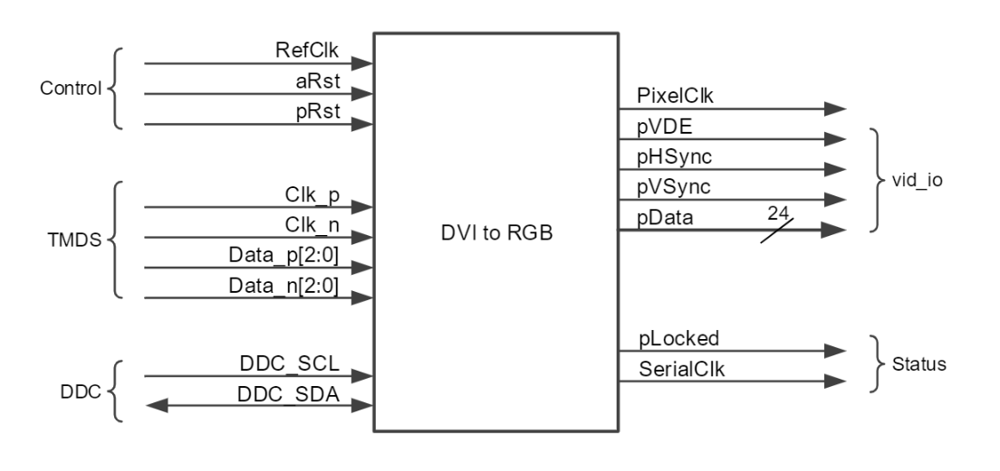{width="4.578125546806649in"
height="2.1593175853018374in"}

Figure 14. DVI to RGB

### RGB to DVI

To accompany the DVI to RGB IP core, Digilent also supplies an RGB to
DVI IP core \[42\]. This core can convert 24bit RGB pixel data, pixel
clock, horizontal sync, vertical sync, and blanking data to TMDS data
conforming to the DVI 1.0 standard for resolutions up to 1920X1080/60hz.

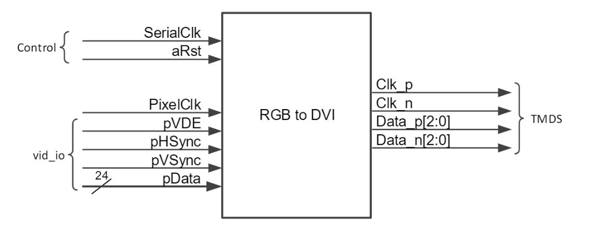{width="4.3125in" height="1.7192366579177603in"}

Figure 15. RGB to DVI

### Physical connections

The Arty Z7 has two HDMI ports (fig. 25). These ports are connected
directly to the FPGA fabric on TMDS enabled pins allowing for video
input and output (i/o) without the need for external ICs, daughter cards
or any of the overhead associated with these solutions.

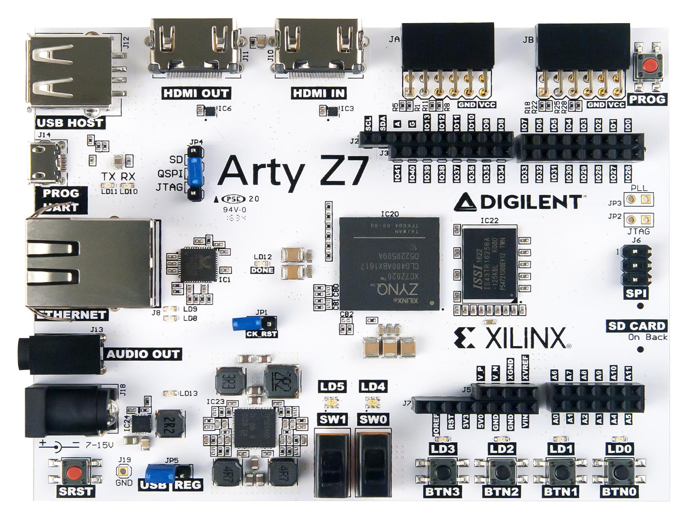{width="2.4843755468066493in"
height="1.3442847769028872in"}

Figure 16. TMDS enabled pins on the ARTY Z7

### The IP Core's Role in Test, Development, and Debug

To test the construction of various elements in the design of this
project, these IP cores were extensively used in test setup 2 (Fig. 11).
Specifically, in the testing of the pixel-wise effects, the DVI to RGB
was connected to the pixel-wise effect and then to the RGB to DVI
module. These cores represented the basis for the DVI through the module
referenced in the iterative development section.

## Test Pattern Generator

### Description

A test pattern generator creates video information that may be used for
testing purposes. A number of commercial IP blocks exist for this
function from providers including Zipcores \[60\] and Xilinx \[61\]. For
this project, a test pattern generator was created as a second video
source (in addition to the DVI input) to demonstrate the alpha blender
and AXI control functions.

### Block Diagram

{width="4.8343952318460195in"
height="1.7204527559055118in"}

Figure 17. Test pattern generator block diagram

### Implementation

This module is driven by the pixel clock (i_clk). This clock in
combination with the horizontal and vertical sync signals drive the
Sync_To_Count module. This module calculates the current pixel value as
both a row and column value (row count and column count). In turn, these
values are used by pattern generators 9,10,11 and 12 to generate
appropriate changes in output colour at specified pixel values. (Table
2.) These outputs are 3-bit colours that are later concatenated to the
8-bit values used in the rest of the design. Finally, the 4-bit pattern
select register (i_pattern) drives a switch statement that selects which
of the twelve patterns will be routed to the RGB outputs.

### Patterns

This test pattern generator can generate 13 test colour patterns
consisting of both solid colours and geometric designs.

+-----------------------+-----------------------+-----------------------+
| 1.  Black             | 2.  Grey              | 3.  White             |
|                       |                       |                       |
| > {width=" | /image21.jpeg){width= |
| /image19.jpeg){width= | 1.6405522747156605in" | "1.583079615048119in" |
| "1.510929571303587in" | > height="1           | > height="1           |
| > height="1           | .1098272090988626in"} | .0631944444444446in"} |
| .0115616797900262in"} |                       |                       |
+-----------------------+-----------------------+-----------------------+
| 4.  Red               | 5.  Green             | 6.  Blue              |
|                       |                       |                       |
| > {width=" | image23.jpeg){width=" | /image24.jpeg){width= |
| 1.6133267716535433in" | 1.6694444444444445in" | "1.574838145231846in" |
| > height="            | > height="1           | > height="            |
| 1.086111111111111in"} | .1270833333333334in"} | 1.086706036745407in"} |
+-----------------------+-----------------------+-----------------------+
| 7.  Magenta           | 8.  Yellow            | 9.  Cyan              |
|                       |                       |                       |
| > {width=" |  confidence](./media/ |
| image25.jpeg){width=" | 1.5944017935258092in" | image27.jpeg){width=" |
| 1.5951388888888889in" | > height="1           | 1.6560159667541556in" |
| > height="1           | .1152777777777778in"} | > height="1           |
| .0773042432195976in"} |                       | .0751443569553807in"} |
+-----------------------+-----------------------+-----------------------+
| 10. Grid B/W          | 11. Grid Colour ![A   | 12. Geometric Pattern |
|                       |     > picture         |     1                 |
| > {width="1.59375in" | > generated](./media/ |
| image28.jpeg){width=" |     > height="1       | image30.jpeg){width=" |
| 1.5953762029746281in" | .0581747594050743in"} | 1.6725721784776904in" |
| > height="1           |                       | > height="1           |
| .0861581364829396in"} |                       | .0338932633420823in"} |
+-----------------------+-----------------------+-----------------------+
| 13. Geometric Pattern |                       |                       |
|     2                 |                       |                       |
|                       |                       |                       |
| > {width= |                       |                       |
| "1.583814523184602in" |                       |                       |
| > height="1           |                       |                       |
| .0461154855643044in"} |                       |                       |
+-----------------------+-----------------------+-----------------------+

: Table 5: Posterize I/O

### Summary and Reflection

An advantage of this pattern generator architecture is its
resolution-agnostic behaviour. The use of the sync-to-count module
removes the need for any kind of parameter containing the target
resolution of the image. Instead, the row and column pixel values are
set and reset by the horizontal sync and vertical sync. This creates a
test pattern generator capable of working at non-standard and dynamic
resolutions.

The 3-bit colour depth used for the pattern generator is a clumsy
solution originally used to simplify the design for simple single-colour
test patterns. It does however create a confusing and nonstandard method
for setting colour and limits the expandability of such a design in the
future. A standard 8-bit colour depth would make this module more
reusable and presents an opportunity for future optimisation.

## Pixel-wise Effects

### Metrics for Success

To judge the success of the pixel-wise effects created for this project,
we need to defined the metrics by which the accuracy and quality may be
assessed.

#### Methods for Assessing Image Accuracy and Quality

##### Mean Squared Error

Mean squared error (MSE) measures the average of the squares of the
errors and is one of the techniques used for measuring success for image
effects in this project. This is the average squared difference between
two values. In this case, the two values are the captured or simulated
image, and the ground truth image which is mathematically derived.

Mean squared error is defined as:

$$MSE\  = \ \frac{1}{\text{mn}}\sum_{i = 1}^{m - 1}{\sum_{j = 1}^{n - 1}{(Y_{i,j} - \widehat{Y_{i,j}})}^{2}}$$

*Equation. 1*

Herein $Y_{i,j}$ represents the ground truth image and
$\widehat{Y_{i,j}}$ represents the image captured by the video capture
device or the simulated image. A small MSE is represents a greater
degree of accuracy.

##### Difference Image

While not strictly an established measure of image quality or accuracy,
a different image may clearly show the areas of difference between two
images on a pixel-by-pixel basis. This method is easily interpreted by a
viewer and because of this is also used as one of metrics of success for
image effects.

It is defined as
$Difference(m,n)\  = \ abs(\text{image}_{1}(m,n) - \text{image}_{2}(m,n))$

##### Camera-Based Quality Measures

Several quality measures exist relevant to lens-based systems, including
lens distortion, light falloff (vignetting) and sensor nonuniformities
and blemishes (visible sensor defects) \[62\]. As this project contains
neither sensor nor lens these measures will not be used.

It is possible that some camera-based quality measures such as lateral
chromatic aberration, noise, and colour moiré (aliasing) could be
present in the output image, but these measures are beyond the scope of
this report.

#### Measurement of HDMI/DVI Capture Artefacts

To test the quality of the generated imagery via HDMI capture as a
viable method, images were captured directly from the Arty Z7 and
compared with images generated by the Xilinx simulator. These were based
on the same RTL using Debut Video Capture and screen recorder software
\[63\].

{width="3.3958333333333335in"
height="2.848117891513561in"}

Figure 18. FPGA DVI capture setup

##### Captured Test Pattern compared against Simulated Test Pattern

+-----------------------------------+-----------------------------------+
| {width="3.1041666666666665in" | .png){width="3.111111111111111in" |
| height="2.3333333333333335in"}    | height="2.3361111111111112in"}    |
|                                   |                                   |
| Figure 19. Image A                | Figure 20. Image B                |
+-----------------------------------+-----------------------------------+
| Image A: Simulated test Image,    | Image B: USB capture card Image,  |
| 640x480                           | 640x480 pixels PNG format         |
+-----------------------------------+-----------------------------------+
| {width="2.3906255468066493in" |
| png){width="2.3906255468066493in" | height="2.3906255468066493in"}    |
| height="2.3906255468066493in"}    |                                   |
|                                   | Figure 22. Image B (0-100,0-100)  |
| Figure 21. Image A (0-100,0-100)  | (zoom)                            |
| (zoom)                            |                                   |
+-----------------------------------+-----------------------------------+

: Table 6: Colorise input/output

While these two captures look largely the same in many ways, a
calculated MSE of 138.5664 shows significant discrepancy between the
images. Viewed as a difference image (Fig. 20) we see the dissimilarity
between the images bearing the distinct blocky effect of discrete cosine
transform (DCT) \[64\] which is both a part of the JPEG and MPEG
encoding standards.

+-----------------------------------+-----------------------------------+
| {width="3.1041666666666665in" | jpg){width="3.1041666666666665in" |
| height="2.3333333333333335in"}    | height="2.3333333333333335in"}    |
|                                   |                                   |
| Figure 23. Image A - Image B      | Figure 24. 10\*(Image A - Image   |
|                                   | B)                                |
+-----------------------------------+-----------------------------------+

: Table 7: RGB to Luma input/output

As such, using MSE between **footage captured directly** from the Arty
Z7 and the **simulated imagery** is not a suitable measure of accuracy
or success.

##### Conclusion

It stands to reason that a transformation performed on an uncompressed
test pattern could be compared to the simulation of HDL IP performing
the same transformation and that MSE would describe the accuracy of this
HDL implementation against the mathematical ideal.

As such, using MSE between **mathematically calculated imagery** and the
**simulated imagery** is a suitable measure of accuracy and success in
author-generated IP meeting its aims.

### Description

Pixel-wise effects are transformations applied to a stream of pixels
without the need for those pixels to be stored in memory. Examples
include colour inversion effects or colour space transformation. Within
this project a number of these effects were created, simulated, tested,
and deployed on the Arty Z7.

### Pixel-wise Effects System Design

{width="6.5in" height="1.30625in"}

Figure 25. Pixel-wise effects structure

### List of Implemented Video Effects

During this project around nine pixel-wise effects were created, five of
which are documented in detail below. These effects were written in
Verilog and simulated with test benches written in behavioural Verilog.
Four effects did not make it into the final project due to the time
constraints. While they were successfully designed and implemented as
stand-alone bitstreams they were never integrated into the final video
mixer design.

#### Aesthetic Effects

Aesthetic effects aim to add interest to video data by altering it in a
visually pleasing manner. There is a long history of aesthetic video
effects present in a range of video mixers and video processing devices.
\[65\]. Many of these aesthetic effects also have use in the wider field
of computer vision and video processing \[66\]. Effects were selected as
they are present in several contemporary and historical video mixer
designs \[17\]\[18\]\[19\]\[20\].

##### Invert Effect

###### Description

This effect is one of the simplest visual effects, in which all three
video channels (red, green, blue) are affected in such a way that values
are re-ordered from 0-254 to 254-0. The simplest way to achieve this is
to perform a bitwise NOT operation.

  ----------------------------------- -----------------------------------
  **Input**                           **Output**

  Video In (inputbus) 24-bit          Video Out (inputbus) 24-bit

  Invert Enable (en) 1-bit            
  ----------------------------------- -----------------------------------

  : Table 8: Alpha blender input/output

$$PixelOut = !(RGB)$$

*Equation. 2*

By performing a bitwise NOT operation the 24-bit pixel bus, as shown in
the above equation, we achieve an inversion effect with minimal hardware
usage.

{width="4.966943350831146in"
height="3.031409667541557in"}

Figure 26. Invert results

###### Summary and Reflection

Figure 28 shows that the implemented invert effect equals the
mathematical ideal (MSE = 0). The simplicity of this effect in terms of
implementation and programming makes it an ideal addition to the
design's effects chain, as much is achieved visually with little
resources or effort.

##### Channel Swap Effect

###### Description

This visual effect re-maps red, green, and blue colour channels to each
other. As with the invert effect, a large amount of visual change is
made with minimal use of FPGA resources and minimal programming time.
This effect can add visual interest to video in myriad ways, such as
swapping channels in time with music.

  ----------------------------------- -----------------------------------
  **Input**                           **Output**

  Video In (vid_pData_in) 24-bit      Video Out (vid_pData_out) 24-bit

  Swap-channel mode (mode) 3-bit      
  ----------------------------------- -----------------------------------

  : Table 9: Auto-fade input/output

$$PixelOut = \begin{bmatrix}
if\ mode\ 1 & R,G,B & = G,B,R \\
if\ mode\ 2 & R,G,B & = B,R,G \\
if\ mode\ 3 & R,G,B & = B,G,R \\
\end{bmatrix}$$

*Equation. 3*

{width="5.192347987751531in"
height="3.2738856080489938in"}

Figure 27. Channel swap results

###### Summary and Reflection

Figure 29 shows that the implemented colour swap effect equals the
mathematical ideal (MSE = 0). As it is possible to achieve this effect
by means of a 3:1 multiplexer, these results are expected. Again, the
simplicity of this effect in terms of implementation and programming
makes it an ideal addition to the design's effects chain.

##### Posterize Effect

###### Description

This effect constitutes the conversion of a continuous gradation of tone
to several regions of fewer tones adding a cartoon-like feel resulting
from large areas of solid colour within an otherwise higher colour depth
image. \[67\] The term 'posterization' refers to the historical process
of reducing the number of colours in a drawing or photograph for offset
printing \[68\]. Its presence in several video mixers used for music
video film clips in the 1980s gives the effect a strong association with
that period.

  ----------------------------------- -----------------------------------
  **Input**                           **Output**

  Video In (vid_pData_in) 24-bit      Video Out (vid_pData_out) 24-bit

  Posterize Level (mode) 3-bit        
  ----------------------------------- -----------------------------------

  : Table 10: Clocked edge-triggered flag

###### Implementation

This effect is the result of a reduction in the number of levels present
within a signal without reducing the number of bits used to represent
that signal. It may be achieved through methods such as

$PixelOut = \left( \frac{\text{RGB}}{x} \right)*x$,

*Equation. 4*

where x represents the posterize amount. This method, which may be
achieved using bit shift operators

$$PixelOut = (RGB \gg x) \ll x$$

*Equation. 5*

is an effective method \[67\]. There are many more additional methods
for reducing colour depth, including lookup table and comparator-based
solutions.

The method selected to implement the posterize effect was found
experimentally. It uses the logical OR operator and set constants that
were tuned to give the desired aesthetic effect.

-   Posterize effect level 5 (least intense) $PixelOut = RGB|7$
    *Equation. 6*

-   Posterize effect level 4 $PixelOut = RGB|15$ *Equation. 7*

-   Posterize effect level 3 $PixelOut = RGB|31$ *Equation. 8*

-   Posterize effect level 2 $PixelOut = RGB|61$ *Equation. 9*

-   Posterize effect level 1 (most intense)$\ PixelOut = RGB|127$
    *Equation. 10*

{width="5.875858486439195in"
height="3.630573053368329in"}

Figure 28. Posterize Results

+-----------------------------------+-----------------------------------+
| {width="2.227777777777778in" | png){width="2.2990113735783027in" |
| height="1.6895231846019247in"}    | height="1.738888888888889in"}     |
|                                   |                                   |
| Figure 29. Unaffected image (R,   | Figure 30. Posterize effected     |
| G, B)                             | image (lv5)                       |
+-----------------------------------+-----------------------------------+
| {width="2.219828302712161in" | png){width="2.2570253718285214in" |
| height="1.7166666666666666in"}    | height="1.6833333333333333in"}    |
|                                   |                                   |
| Figure 31. Posterize effected     | Figure 32. Posterize effected     |
| image (lv4)                       | image (lv3)                       |
+-----------------------------------+-----------------------------------+
| {width="2.227777777777778in" | png){width="2.2569444444444446in" |
| height="1.6671445756780403in"}    | height="1.7267891513560805in"}    |
|                                   |                                   |
| Figure 33. Posterize effected     | Figure 34. Posterize effected     |
| image (lv2)                       | image (lv1)                       |
+-----------------------------------+-----------------------------------+

: Table 11: GPIO control bus

The figures above show the implemented posterize effect at all five
levels of intensity.

###### Summary and Reflection

One of the key weaknesses of this method is the loss in the darkness of
the blacks in low levels (level 1 and 2). This is seen as an overall
lightening of the image and a reduction in dynamic range. Additional
work would need to be performed to preserve these dark colours without
loss of bright colours.

##### Colourise Effect

###### Description

This effect, also referred to as false colour, has a range of uses in
visual applications such as representing temperature in thermal cameras
\[69\] and exposure and focus level on high-end video cameras \[70\]. It
works by taking a mono-colour image and mapping ranges of luminosity to
selected RGB colours.

  ----------------------------------- -----------------------------------
  **Input**                           **Output**

  Video In (vid_pData_in) 24-bit      Video Out (vid_pData_out) 24-bit

  Colorise Mode (mode) 3-bit          
  ----------------------------------- -----------------------------------

  : Table 12: Alpha mixer value unsigned 10-bit integer

###### Implementation

The design of this module is based around a series of comparators driven
by an incoming luminance channel.

$$\text{PixelOut}_{\text{RGB}} = f(x) = \left\{ \begin{matrix}
(252,3,3),\ \ \& 0 \leq x \leq 50 \\
(252,240,3),\ \ \& 51 \leq x \leq 100 \\
(3,252,107),\ \ 101 \leq x \leq 150\  \\
(3,198,252),\ \ 151 \leq x \leq 200 \\
(219,3,252),\ \ 201 \leq x \leq 254 \\
\end{matrix} \right.\ $$

*Equation. 11*

Where x is the luma of the range 0-254 and Pixel Out is a 24bit value
consisting of three 8-bit values (red, green, and blue) concatenated
into a single bus.

{width="5.437243000874891in"
height="3.2738856080489938in"}

Figure 35. Colorise Results

###### Summary and Reflection

Only one colour palette was created for the colourise effect.
Regardless, it is possible to observe the striking nature of the effect
in Figure 37. The fine gradations of the test pattern image results in
small, jagged shapes that while correct, are not visually pleasing. It
is possible that better selection of colour ranges, or more or fewer
colours would result in more visually pleasing results. An MSE of
139.857 along with the difference image reveal minor inconsistencies in
the simulated image, the source of this is unclear. As this effect only
has a single colour scheme and some issues with aesthetic appearance it
was only somewhat successful.

#### Colour Space Effects and Transformations

##### RGB to Luma Effect

###### Description

This effect extracts luminosity from an RGB image by calculating the
arithmetic average of all three channels. Luminosity forms one of the
three channels in YpbPr\[71\], HSL \[72\] and YUV \[73\] colour spaces.
These colour spaces are crucial for image manipulation and compression.
Additionally, luminosity data is needed for effects such as a luma-key.

  ----------------------------------- -----------------------------------
  **Input**                           **Output**

  Video In (vid_pData_in) 24-bit      Video Out (vid_pData_out) 24-bit

  FX Enable (en) 1-bit                
  ----------------------------------- -----------------------------------

  : Table 13: Test pattern value unsigned 4-bit integer

###### Implementation

A wide number of methods exist for calculating luma from RGB pixel
value. The ITU-R BT.709 \[74\] standard uses
$Y = 0.2126R + 0.7152G + 0.0722B$. But as this project does not conform
to a specific standard and instead seeks a more general solution, the
arithmetic mean is used to derive luma. As Verilog does not natively
handle floating point values these will be truncated.

$$Y = (R + G + B)/3$$

*Equation. 12*

{width="6.193187882764654in"
height="3.9235673665791775in"}

Figure 36. RGB to Luma Results

Figure 38 shows a relatively small MSE of 0.327. This may be the result
of differences in rounding/truncation between MATLAB and Verilog. The
scaled difference image (Difference \* 10) shows no noticeable
discrepancy between the two images suggesting that the difference is
minor.

###### Summary and Reflection

The simplicity and general nature of the arithmetic mean method of
converting from RGB to luma in addition to not needing the complexity or
overhead of the floating-point operations of standards such as the
BT.709 (also achievable via a lookup table), makes this effect another
simple yet effective candidate for the effects chain.

## Mixer/Alpha Blender

### Description 

One of the qualities that makes a video mixer distinct from a switcher
is its ability to transition between video sources in real time in a
smooth aesthetically pleasing way. The simplest form of this transition
is the alpha blend. It is from this transition effect that more complex
transitions such as hard/soft wipes or special effect transitions such
as luma key transitions may be created. As such an alpha blender was
generated for this project. \[75\]

  ----------------------------------- -----------------------------------
  **Input**                           **Output**

  Pixel-clock (clk1x) 1-bit           Red Out, Green Out, Blue Out
                                      (r_blnd, r_blnd, r_blnd) 3X10-bit

  Red In A, Green In A, Blue In A     
  (r_strm0, r_strm0, r_strm0)         
  3X10-bit                            

  Red In B, Green In B, Blue In B     
  (r_strm1, r_strm1, r_strm1)         
  3X10-bit                            

  Alpha blend coefficient             
  (alpha_strm) 10-bit                 
  ----------------------------------- -----------------------------------

  : Table 14: FX value concatenated, unsigned integers of length 3-bit,
  3-bit, 2-bit, 1-bit, and 1-bit

### Implementation

Verilog cannot work with floating-point values directly. However, VHDL
does not suffer from this restriction, and as Vivado 2020 can work with
projects that are a mix of VHDL and Verilog, this module was written in
VHDL.

This module is important because it provides the foundation for many
transitions and effects. By using this alpha blending module and driving
the alpha value in several different ways, a range of soft and hard
wipes are achievable as well as more nuanced luma and chroma key effects
\[75\].

The alpha blending effect is defined by the following equation, where
$\alpha$ (a value between 0 and 1) determines the amount of each pixel
value present in PixelOut. This module consists of three alpha blenders,
one for each of the R, G and B channels.

$$PixelOut\  = \ \alpha \cdot Pixel_{\text{in\ A\ }} + (1 - \alpha) \cdot Pixel_{\text{in\ B}}$$

*Equation. 13*

+-----------------------------------+-----------------------------------+
| {width="1.7195002187226596in" | .jpg){width="1.738888888888889in" |
| height="1.332638888888889in"}     | height="1.2777777777777777in"}    |
|                                   |                                   |
| Figure 37. Alpha blend 0%         | Figure 38. Alpha blend 25%        |
+-----------------------------------+-----------------------------------+
| {width="1.617810586176728in" | jpg){width="1.6861111111111111in" |
| height="1.2847222222222223in"}    | height="1.2333333333333334in"}    |
|                                   |                                   |
| Figure 39. Alpha blend 50%        | Figure 40. Alpha blend 75%        |
+-----------------------------------+-----------------------------------+
| {width="1.6291666666666667in" |                                   |
| height="1.214484908136483in"}     |                                   |
|                                   |                                   |
| Figure 41. Alpha blend 100%       |                                   |
+-----------------------------------+-----------------------------------+

: Table 15: Summarized Resource Utilization \[80\]

### Summary and Reflection

As the basis for future transition effects, this module was highly
successful. Transition effects such as a cut are alpha blends that
transitions from 0 to 1 between frames. A wipe is an alpha blend from 0
to 1, that takes place at a specified pixel location. For example, a 50%
horizontal wipe transitions from e to 1 at 50% of the frame width for a
hard transition and from 0 to 1 over a set number of frames starting
before and ending after 50% of the frame width. With this single effect
this module greatly increases the diversity of aesthetic possibilities
for the video mixer.

## Auto-fade

### Description

An auto-fade module allows a smooth fade from one video source to
another over a set period. This is often used to create a natural
feeling transition in live visuals and many video mixers employ an
auto-fade of some kind.

  ----------------------------------- -----------------------------------
  **Input**                           **Output**

  Clock In (clk) 1-bit, Reset (rst)   Fade done flag (autoFadeDone) 1-bit
  1-bit                               

  Trigger fade to 0 (trigA) 1-bit     Output Value (mix_val) 10-bit

  Trigger fade to 1023 (trigB) 1-bit  

  Fade speed (speed) 3-bit            

  Fade position (tbar) 10-bit         
  ----------------------------------- -----------------------------------

### Implementation

This auto-fade module works via a state machine that when triggered
captures the current alpha coefficient (sometimes refed to as the T-bar
or fader) and interpolates from that value to either extreme of the
alpha coefficients value (0 or 1023). Upon reaching this extreme value,
the state machine exits the auto-fade maintaining the final value if the
fade ended successfully. Additionally, the auto-fade is
user-interruptible meaning that if the alpha coefficients are altered by
the user during the fade the state machine will exit set to the newly
updated user value.

{width="5.7278619860017495in"
height="2.55in"}

Figure 42. Auto-fade block diagram

### State Machine diagram

{width="2.8688845144356954in"
height="3.6444444444444444in"}

Figure 43. Auto-fade state diagram

At start-up or reset the state machine clears its registers and
transitions to the idle state. Here, the fade position value (tbar
signal) is passed to the output. On a positive edge from either the
*TrigA* or *TrigB* signals there is a transition to the work state. In
this state the *stepCounter* register is incremented on transitions of
the clock divider bit corresponding to the value of the fade speed
(speed bus). Upon either the *stepCounter* register reaching a value of
1023 or a change in the fade position (T-bar bus) there is a transition
to the done state. In the done state registers are reset, the
*autoFadeDone* flag is set high and there is a transition back to the
idle state.

### Debugging

Due to the complexity of this module and the lack of existing reference
material for the design, a large amount of debugging was required to
both verify correct operation and correct state transitions of the
module. Implementation and integration into the final design introduced
several additional complications such as the need to drive some of the
logic from a clock divider and other logic from the pixel clock,
creating the issue of timing errors. These errors prevented successful
implementation and bitstream generation in Vivado. This issue was solved
by creating a clocked, edge-triggered flag *fadeClkTrig* \[76\] which in
turn can be used to update the *stepCounter* on pixel clock transitions
that correspond with the desired state of the clock divider. The Verilog
code for this method is shown in table 10.

+-----------------------------------------------------------------------+
| always @ (posedge clk) begin                                          |
|                                                                       |
| o_fadeTrig \<= i_fadeTrig;                                            |
|                                                                       |
| assign fadeClkTrig = (\~o_fadeTrig & i_fadeTrig);                     |
+=======================================================================+
+-----------------------------------------------------------------------+

### Summary and Reflection

This module proved one of the most complex of the project in terms of
integration into the final design and requiring a great deal of
simulation and debugging to verify correct operation. As the fade
counter is a clock divider using its output to drive, the interpolator
would create a secondary clock source within the module. To avoid clock
instability an edge-triggered flag was used to advance the fade counter
instead.

Unfortunately due to time constraints this module is only partially
working n the final design.

## Hard Processor Control 

The Arty Z7 \[1\] uses the XC7Z020-1CLG400C IC (Zync APSoC) from Xilinx
\[2\]. This chip makes use of a dual ARM Cortex A9 hard processor (PS)
which shares the same package as the FPGA programmable logic (PL).

The PS and PL sides of the APSoC are connected using several protocols
including EMIO, AXI, High-Performance AXI and ACP. By defining these
interfaces in Vivado 2020 (fig. 47) it is possible to use them in HDL
design.

### PS to PL bridge using AXI

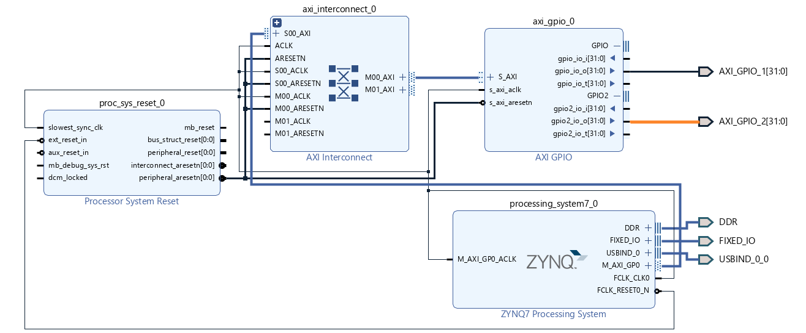{width="6.5in" height="2.6944444444444446in"}

Figure 44. Vivado block design for AXI-GPIO

The large number of control parameters needed for this project creates
the need for a simple, user-friendly interface. By using Xilinx's
built-in AXI-GPIO interface IP \[77\], a 32bit variable updated by the
PS can update the state of the PL design. This allows elements such as
the alpha mixer fade value, test pattern image and video effects to be
changed easily and in real-time by a user.

To achieve this control a simple USB UART to AXI-GPIO program was
written in embedded C using Vitis2020 \[54\].

### UART control

#### Software Structure

{width="6.5in"
height="1.9333333333333333in"}

Figure 45. PS program structure

The program running on the PS side of the Arty Z7 was programmed in C++
and designed to act as an interface for controlling the parameters of
the design including the T-bar (mix position), pixel-wise effects and
the test pattern generator. It operates standalone, without an OS or
RTOS in a mode Xilinx calls 'Bare Metal'. This program is designed to be
both a method for testing during development and a method for
demonstrating the functionality of the final project.

It functions by receiving commands via the USB UART, parsing the
commands and then updating the AXI-GPIO register which in turn updates
the state of the AXI-GPIO IP on the PL side of the design. This process
is illustrated in Figure 48 and in more detail in the sections below.

#### Development Process

This software was developed by creating a simple program that echoed USB
UART messages. Next, a program that made use of the AXI-GPIO control was
implemented to drive the built-in LEDs on the Arty Z7. Finally, the
program above was developed by first adding functionality for the alpha
blending followed by the effects and finally the test pattern generator.

#### UART Command Format 

By creating several different methods for controlling the project\'s PL,
we hoped that a balance between fast efficient communication and
simple-to-use, human-readable commands could be achieved.

This program makes use of the USB UART of the ArtyZ7 with the following
settings:

-   Baud Rate = 115200

-   Data Size = 8bit

-   Parity = none

-   Stop Bits = 1

-   Flow control = off

All valid serial commands are sent as ASCII with the '/' exit character.
This allows for multiple commands to be packed together in a single
transmission.

##### Raw UART Command Format

If a message takes the form of an integer followed by the '/' exit
character, all bits of the 32bit control register will be updated and
sent to the PL.

For example, the command "4321/", corresponds to the binary number
1000011100001. When separated between the three sub-registers (FX, test
pattern and alpha mixer) gives values of:

-   FX = 0

-   test pattern = 4

-   alpha mixer = 225

  ----- ---- --------- ---- ---- ---- --------- ---- --------- ---- ---- ---- ---- ---- ---- -----
  31    30   29        28   27   26   25        24   23        22   21   20   29   18   17   16

  MSB                                                FX Value                                
                                                     (10bit)                                 

  15    14   13        12   11   10   9         8    7         6    5    4    3    2    1    0

             Test                     Alpha                                                  LSB
             Pattern                  Mixer                                                  
             Value                    Value                                                  
             (4bit)                   (10bit)                                                
  ----- ---- --------- ---- ---- ---- --------- ---- --------- ---- ---- ---- ---- ---- ---- -----

The above values may be treated as equivalent to:

  ------- ------- ------- ------- ------- ------- ------- ------- ------- -------
  MSB     Alpha                                                           LSB
          Mixer                                                           
          Value                                                           

  9       8       7       6       5       4       3       2       1       0
  ------- ------- ------- ------- ------- ------- ------- ------- ------- -------

  ----------------- ----------------- ----------------- -----------------
  MSB               Test Pattern                        LSB
                    Value                               

  3                 2                 1                 0
  ----------------- ----------------- ----------------- -----------------

  ---------- ------- ------- ----------- ------- ------- --------- ------- -------- -------
  Colorise                   Posterize                   Swap              Invert   Mono
                                                         Colours                    

  2          1       0       2           1       0       1         0       0        0
  ---------- ------- ------- ----------- ------- ------- --------- ------- -------- -------

##### Directed UART Command Format

If a message takes the form of a single, uppercase character followed by
an integer and finally the '/' exit character, only a specific part of
the register will be updated, all other bits will remain unchanged.

This is achieved by bit-masking to clear the old value within the
register and combining the result with the new value bit shifter right
to the appropriate location.

###### 'P' Command: Pattern Generator Control

A command "P2/" sets the test pattern generator to output pattern 2 and
leaves all other parts of the register unaffected.

###### 'T' Command: Alpha Mixer Control

A command "T500/" sets the alpha mixer's blend amount to 500 (around ½
way mixed between the test pattern and live video inputs) and leaves all
other parts of the register unaffected.

###### 'F' Command: Pixel-wise Effects Control

A command "F326/" corresponds to a binary value of 101000110, which will
be interpreted as follows. Colorise = 2, Posterize = 4, Swap Colours =
1, Invert = 1 and Mono = 0.

All other parts of the register are unaffected.

F commands also accept direct control of each effect using a second
character. The command "FI1/" sets the invert effect to the value 1 (on)
leaving all other effect values unaffected.

These characters are:

-   Colorise = C

-   Posterize = P

-   Swap Colours = S

-   Invert = I

-   Mono = M

#  Additional Exploration

As part of this capstone project, some avenues of exploration ended up
not being required for the final design. The more significant and
interesting paths of exploration are documented herein.

## Second HDMI Input

The final project design utilises a single DVI input and output via HDMI
plugs, but as part of the development process, additional inputs were
tested. Below is the documented process for converting the HDMI output
of the ArtyZ7 into a second input. At the time of writing, this process
has not been documented outside of this project.

Section 2.2.9 of the DVI 1.0 standard \[31\] describes the operation of
the hot plug detect signal. A DVI receiver (sometimes called DVI RX, DVI
sink or simply monitor) asserts a 5v signal on the hot plug detect line.
This in turn triggers a 'monitor attach event' which involves the
transfer of EDID timing and resolution data between DVI source and sink.
Thus, for standard DVI sources to treat an HDMI port on the ArtyZ7 as an
input, a hot plug detect signal is necessary. \[79\].

Looking at Figure 49, it is possible to assert the hot plug detect
signal from the HDMI RX port, but not from the HDMI TX port due to the
arrangement of the Q4 MOSFET. Except for how the hot plug signal is
treated, the TX and RX signal connections on the Arty Z7 appear
identical, and so by bypassing Q4 with a small wire, the hot plug detect
on the HDMI TX port can be connected to the hot plug detect on the HDMI
output port

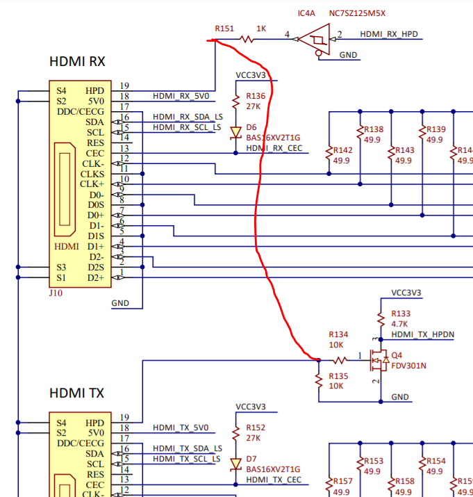{width="3.0364588801399823in"
height="3.1854866579177603in"}

Figure 46. Schematic of HDMI plugs for ArtyZ7 with TX and RX hot plug
signals joined \[1\]

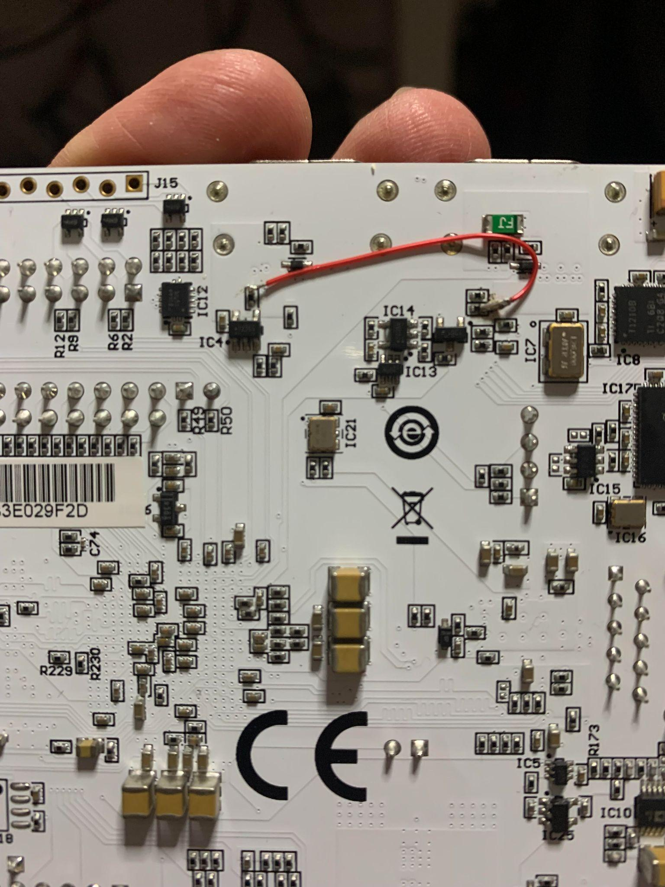{width="5.369792213473316in"
height="2.1255424321959757in"}

Figure 47. Image of hot plug signals joined on bottom of ArtyZ7

By connecting R151 to R 134, HDMI_RX_HPD can act as the hot plug assert
for both HDMI ports.

By making this adjustment to the ArtyZ7 board it has been tested and
confirmed that it is possible to reverse the HDMI RX and TX ports or use
both ports as inputs.

## Second HDMI Output

As part of the development process the capacity to output a second
digital video signal from the Arty Z7 was developed using the high speed
PMOD ports of the development board and a PMOD to

PMOD output \[1\]. This second output required no additional changes to
the HDL design, and the DVI out signals were simply routed to the PMOD
port. This output was tested with resolution up to 800 x 600 pixels.

## Resource Utilisation 

The overall project achieves a large amount with minimal resource usage.
This leaves substantial room to expand on this project or integrate it
into another design without the risk of running out of resources.

  ----------------------- ----------------------- -----------------------
  **Resource**            **Number used**         **% Used**

  Slice LUTS              2585                    4.86

  Slice Registers         3727                    3.5

  F7 Muxes                34                      0.13

  F8 Muxes                8                       0.06

  Block RAM Tile          1                       0.71

  DSPs                    8                       3.64

  IDELAYCTRL              1                       25

  MMCME2_ADV              2                       50

  PLLE2_ADV               1                       25
  ----------------------- ----------------------- -----------------------

The full resource utilisation report may be found in the appendix.

From Table 15, we see that the highest utilised resources are the
specialised components such as the IDELAYCTRL \[81\] which is
responsible for generating a reference clock and the MMCME2_ADV and
PLLE2_ADV, a dynamic clock, and PLL respectively.

## Deployed Design

+-----------------------------------+-----------------------------------+
| {width="2.466281714785652in" | peg){width="2.4971095800524936in" |
| height="1.8497112860892388in"}    | height="1.8728324584426947in"}    |
|                                   |                                   |
| Figure 51. Working video mixer    | Figure 48. Invert effect          |
+===================================+===================================+
| {width="2.4816951006124235in" | jpeg){width="2.546242344706912in" |
| height="1.8612718722659667in"}    | height="1.9096817585301837in"}    |
|                                   |                                   |
| Figure 49. Colourise effect       | Figure 50. Invert and posterize   |
|                                   | effect                            |
+-----------------------------------+-----------------------------------+
| {width="2.5047156605424323in" | generated](./media/image67.j      |
| height="1.8785367454068242in"}    | peg){width="2.4691721347331583in" |
|                                   | height="1.851878827646544in"}     |
| Figure 51. 50% test pattern 50%   |                                   |
| DVI input                         | Figure 52. Test Pattern           |
+-----------------------------------+-----------------------------------+

### Summary and Discussion

The successful implementation and operation of the design is
demonstrated in the figures above. The project successfully mixes two
channels of digital video (internal test pattern generator and external
DVI 720p signal) and features several visual effects all under the
control of the hard processor. The project has a quick response to
incoming USB UART commands and the video output is recognized by an
external monitor in around two seconds.

#  Recommendations and Future Work

During the development of this project several topics and features were
explored but eventually abandoned due to the time constraints of the
project.

## Frame Buffer

Xilinx Series 7 FPGAs are capable of supporting frame buffers stored in
DDR3 memory via the VDMA IP Core \[ref\]. This IP core implements a
pathway for video data to be stored and retrieved by the PL fabric of
the FPGA while also having the ability to be manipulated by the PS side
through software manipulation. Multiple frame buffers would be required
for a multi-input video mixer. While this was explored and some attempts
were made to implement this functionality, the lack of simple-to-follow
tutorials and the perceived large overhead on both the PL and PS sides
of the FPGA were the reasoning behind exiting the ON/OFF ramp at this
stage. It was decided that a fully-realised demonstrable project would
be more valuable than a frame buffer which, while technically
impressive, would not be visible to an observer unless significant work
was undertaken to either build visual effects using the frame buffer or
implement a send buffer for multi-channel video mixing.

## Additional Pixel-wise Effects and Mixing Modes

In the development of this project a range of additional pixel-wise
effects were created including a chromatic abrasion effect and a liquid
glitch effect. However, due to the number of effects already created for
the project and the overhead implementing them, they were not integrated
into the final project.

Future direction for this work may involve implementing these effects or
utilizing the alpha blending module to perform whipping or special
effects such as luma keys.

## TCP/IP and UDP control

This project explored UDP or TCP/IP network control as an alternative to
the USB UART method of communication. While this method is possible, and
C++ examples using the LWIP \[82\] stack were explored, it was decided
that the return on investment for this feature was not adequate. As part
of this exploration a basic cross platform mobile application was built
in React Native with a user interface and the ability to broadcast UDP
messages.

{width="1.5668788276465442in"
height="2.0891721347331584in"}

Figure 54. Custom iPhone App

## Physical User Interface

A physical user interface would be a significant user-experience,
improvement and make interacting with the project simpler and more
intuitive for a user. Whilst several options for a physical interface
were explored including buttons, rotary encoders, and a physical T-bar
(fig 55), integrating these fell outside the scope and timeline for the
project. The Arty Z7 has the capabilities to connect buttons, rotary
encoders, and even analogue voltage sources. Adding these would increase
the project complexity as there would be a need to introduce, a second
AXI-GPIO module to allow these physical elements to communicate with the
PS program and maintain the state between the physical interface and USB
UART methods for updating the state of the design.

{width="2.594570209973753in"
height="3.459426946631671in"}

Figure 55. Two T-bar designs created for the project

## Organisation and Time Management

During development a large amount of time was spent documenting and
preparing assessment and reports that limited the amount of technical
work that could be undertaken, and the number of features That could be
integrated into the design. Future work would focus on executing more
technical work and would seek to reduce documentation time by
investigating tools such as Doxigen \[83\] a tool that automatically
documents code.

# Conclusion

The goal of this project was to document a practical implementation of a
real-time hardware video mixer to increase the available resources
around this subject. An initial hypothesis was that an FPGA-based
solution would be relatively low-cost, accessible and possess adequate
compute resources to be a good candidate for the task. This assumption
proved to be correct with the relatively low cost, high availability of
technical resources and customizable nature of the technology, alongside
the huge potential for parallel processing, confirming a FPGA-based
solution as a clear choice for this kind of work over similarly
positioned multimedia processors or general computing systems. As with
any solution, there are trade-offs to working with FPGAs. Some of these
include a small community of people working with the technology limits
available, resources and support, and a steep learning curve with few
tutorials or example projects available. Hopefully, some of the
challenges and solutions outlined in this document can be shared more
broadly and go some way to creating resources for future development in
this field.

# References

**\[1\]**Digilent, "Arty Z7 Reference Manual - Digilent Reference,"
*reference.digilentinc.com*, Apr. 08, 2021.
https://reference.digilentinc.com/reference/programmable-logic/arty-z7/reference-manual
(accessed Apr. 08, 2021).

**\[2\]**Xilinxs, "Zynq-7000 SoC," *Xilinx*, Apr. 08, 2021.
<https://www.xilinx.com/products/silicon-devices/soc/zynq-7000.html>.

**\[3\]**M. Jacobs and J. Probell, "A Brief History of Video Coding,"
2009. Accessed: Oct. 20, 2021. \[Online\]. Available:
<http://www.probell.com/pubs/A_Brief_History_of_Video_Coding_wp.pdf>.

**\[4\]**Intel, "Video Broadcast Over IP and Pro A/V Solutions - Intel®
FPGAs," *Intel*, 2021.
[https://www.intel.la/content/www/xl/es/broadcast/products/programmable/overview.html](https://www.intel.la/content/www/xl/es/broadcast/products/programmable/overview.html%20)

(accessed Oct. 20, 2021).

**\[5\]**G. J. Awcock and R. Thomas, *Applied image processing*. New
York: Mcgraw-Hill, 1996.

**\[6\]**D. G. Bailey, *Design for embedded image processing on FPGAs*.
Singapore: John Wiley & Sons (Asia), Cop, 2011.

**\[7\]**Dimentions.ai, "Dimentions.ai," *Dimentions.ai*, 2021.
[https://app.dimensions.ai/analytics/publication/overview/timeline?search_mode=content&search_text=real-time%20video&search_type=kws&search_field=text_search&year_from=1972&year_to=2021](https://app.dimensions.ai/analytics/publication/overview/timeline?search_mode=content&search_text=real-time%20video&search_type=kws&search_field=text_search&year_from=1972&year_to=2021%20)
(accessed Oct. 20, 2021).

**\[8\]**K. E. Hollist, "Time to Be Grown-Ups about Video Gaming: The
Rising eSports Industry and the Need for Regulation," *Arizona Law
Review*, vol. 57, no. 57, p. 823, 2015, Accessed: Feb. 17, 2021.
\[Online\]. Available:
<https://heinonline.org/HOL/LandingPage?handle=hein.journals/arz57&div=29&id=&page=>.

**\[9\]**M. R. Johnson and J. Woodcock, "The impacts of live streaming
and Twitch.tv on the video game industry," *Media, Culture & Society*,
vol. 41, no. 5, pp. 670--688, Dec. 2018, doi: 10.1177/0163443718818363.

**\[10\]**Statista, "Global YouTube audience growth 2021," *Statista*,
2018.
<https://www.statista.com/statistics/805671/youtube-viewer-number-growth-world/>
(accessed Feb. 17, 2021).

**\[11\]**Conviva, "Q2 2019 Covina's State of the Streaming TV
Industry," Covina, Jul. 2019. Accessed: Feb. 17, 2021. \[Online\].
Available[:
http://pages.conviva.com/rs/138-XJA-134/images/INFOGRAPHIC_2019_Q2_SoS.pdf](:%20http:/pages.conviva.com/rs/138-XJA-134/images/INFOGRAPHIC_2019_Q2_SoS.pdf).

**\[12\]**The Insight Partners, "Presentation Switcher Market to 2027 -
Global Analysis and Forecasts by Power Consumption ; Application," The
Insight Partners, Dec. 2019. Accessed: Feb. 17, 2021. \[Online\].
Available:
<https://www.reportlinker.com/p05862190/Presentation-Switcher-Market-to-Global-Analysis-and-Forecasts-by-Power-Consumption-Application.html?utm_source=GNW>.

**\[13\]**Xilinx, "Routers & Switchers," *Xilinx*, Apr. 08, 2021.
[https://www.xilinx.com/applications/broadcast/router-switcher.html](https://www.xilinx.com/applications/broadcast/router-switcher.html%20)
(accessed Apr. 08, 2021).

**\[14\]**S. M. Trimberger, "Three Ages of FPGAs: A Retrospective on the
First Thirty Years of FPGA Technology," *IEEE Xplore*, Mar. 03, 2015.
<https://ieeexplore.ieee.org/stamp/stamp.jsp?arnumber=7086413&tag=1>
(accessed Apr. 08, 2021).

**\[15\]**Sherry Miller Hocking, M. Jimenez, and K. High, *The emergence
of video processing tools : television becoming unglued*. Bristol ;
Chicago: Intellect, 2014.

**\[16\]**M. Faulkner and D-Fuse, VJ : audio-visual art + VJ culture.
London: Laurence King, 2006.

**\[17\]**Roland Corporation, "Roland Pro A/V - V-4 \| 4 Channel Video
Mixer with Effects," *Roland Pro A/V*, 2021.
[https://proav.roland.com/global/products/v-4/](https://proav.roland.com/global/products/v-4/%20)
(accessed Oct. 20, 2021).

**\[18\]**Roland Corporation, "Roland Pro A/V - V-8 \| Eight-Channel
Video Mixer with Effects," *Roland Pro A/V*, 2021.
[https://proav.roland.com/global/products/v-8/](https://proav.roland.com/global/products/v-8/%20)
(accessed Oct. 20, 2021).

**\[19\]**Roland Corporation, "Roland Pro A/V - V-4EX \| 4-Channel
Digital Video Mixer with Effects," *Roland Pro A/V*, 2021.
[https://proav.roland.com/global/products/v-4ex/](https://proav.roland.com/global/products/v-4ex/%20)
(accessed Oct. 20, 2021).

**\[20\]**Roland Corporation, "Roland Pro A/V - V-1HD \| HD Video
Switcher," *Roland Pro A/V*, 2021.
[https://proav.roland.com/global/products/v-1hd/](https://proav.roland.com/global/products/v-1hd/%20)
(accessed Oct. 20, 2021).

**\[21\]**Intel, "Intel® SoC FPGAs Programmable Devices," *Intel*, Apr.
08, 2021.
[https://www.intel.com.au/content/www/au/en/products/programmable/soc.html](https://www.intel.com.au/content/www/au/en/products/programmable/soc.html%20)
(accessed Apr. 08, 2021).

**\[22\]**Xilinx, "Routers & Switchers," *Xilinx*, Apr. 08, 2021.
[https://www.xilinx.com/applications/broadcast/router-switcher.html](https://www.xilinx.com/applications/broadcast/router-switcher.html%20)
(accessed Apr. 08, 2021).

**\[23\]**Xilinxs, "SoCs, MPSoCs and RFSoCs," Xilinx, 08-Apr-2021.
\[Online\]. Available:
<https://www.xilinx.com/products/silicon-devices/soc.html>. \[Accessed:
08-Apr-2021\]

**\[24\]**Intel, "Intel® SoC FPGAs Programmable Devices," Intel,
08-Apr-2021. \[Online\]. Available:
<https://www.intel.com.au/content/www/au/en/products/programmable/soc.html>.
\[Accessed: 08-Apr-2021\]

**\[23\]**Mathworks, "MATLAB - MathWorks," *au.mathworks.com*, 2021.
<https://au.mathworks.com/products/matlab.html>.

**\[24\]**Xilinx, "Vivado Simulator," Xilinx, 10-Apr-2021. \[Online\].
Available:
[https://www.xilinx.com/products/design-tools/vivado/simulator.html#:\~:text=Vivado%C2%AE%20Simulator%20is%20a](https://www.xilinx.com/products/design-tools/vivado/simulator.html%23:~:text=Vivado%C2%AE%20Simulator%20is%20a).
\[Accessed: 10-Apr-2021\]

**\[25\]**M. K. Patel, "9. Testbenches --- FPGA designs with Verilog and
SystemVerilog documentation," verilogguide.readthedocs.io, 2017.
\[Online\]. Available:
<https://verilogguide.readthedocs.io/en/latest/verilog/testbench.html>.
\[Accessed: 10-Apr-2021\]

**\[26\]**D. Gisselquist, "ZipCPU/vgasim," GitHub, 09-Mar-2021.
\[Online\]. Available: <https://github.com/ZipCPU/vgasim>

**\[27\]**C. Pantelides, "Seguridad Agile: VGA Rendering de simulación
FPGA," Seguridad Agile, 22-Dec-2019. \[Online\]. Available:
<https://seguridad-agile.blogspot.com/2019/12/vga-rendering-de-simulacion-fpga.html>.
\[Accessed: 10-Apr-2021\]

**\[28\]**Verilator, "Intro - Verilator - Veripool," www.veripool.org,
2021. \[Online\]. Available: <https://www.veripool.org/wiki/verilator>.
\[Accessed: 10-Apr-2021\]

**\[29\]**Puzzling Plans LLC., "8bitworkshop IDE," 8bitworkshop.com,
10-Apr-2021. \[Online\]. Available:
<https://8bitworkshop.com/v3.7.1/?platform=verilog&file=digits10.v>.
\[Accessed: 10-Apr-2021\]

**\[30\]**HDMI Licensing, LLC, "High-Definition Multimedia Interface
Specification Version 1.3a," Wayback Machine, 05-Mar-2016. \[Online\].
Available:
[https://web.archive.org/web/20160305072940/http://www.microprocessor.org/HDMISpecification13a.pdf](https://web.archive.org/web/20160305072940/http:/www.microprocessor.org/HDMISpecification13a.pdf).
\[Accessed: 01-Apr-2021\]

**\[31\]**DDWG, "Digital Visual Interface DVI Revision 1.0," DDWG, Apr.
1999 \[Online\]. Available:
<https://www.fpga4fun.com/files/dvi_spec-V1_0.pdf>. \[Accessed:
01-Apr-2021\]

**\[32\]**B. Fang and E. Crabill, "Video Connectivity Using TMDS I/O in
Spartan-3A FPGAs," xilinx.com, 2011.

**\[33\]**B. Feng, "Implementing a TMDS Video Interface in the Spartan-6
FPGA," xilinx.com, 2010. \[Online\]. Available:
<https://www.xilinx.com/support/documentation/application_notes/xapp495_S6TMDS_Video_Interface.pdf>.
\[Accessed: 05-Apr-2021\]

**\[34\]**Xilinx, "HDMI 1.4/2.0 Transmitter Subsystem v3.1 Product
Guide," 2020 \[Online\]. Available:
<https://www.xilinx.com/support/documentation/ip_documentation/v_hdmi_tx_ss/v3_1/pg235-v-hdmi-tx-ss.pdf>.
\[Accessed: 09-Apr-2021\]

**\[35\]**M. Field, "hamsternz/Artix-7-HDMI-processing," GitHub,
28-Feb-2021. \[Online\]. Available:
<https://github.com/hamsternz/Artix-7-HDMI-processing?fbclid=IwAR0AhhA8dC9L7_Pag9nX-2bbOXaQa5idYd3_TmdAr6iKX8RFG7zJiCsIO34>.
\[Accessed: 09-Apr-2021\]

**\[36\]**Warmcat.com, "HDMI Capture and Analysis FPGA Project 2,"
Warmcat.com, Oct-2015. \[Online\]. Available:
<https://warmcat.com/hardware%20design/hdmi/fpga/2015/10/21/hdmi-capture-and-analysis-fpga-project-2.html>.
\[Accessed: 10-Mar-2021\]

**\[37\]**Digilent, "Digilent/Arty-Z7-20-hdmi-in," GitHub, 10-Apr-2021.
\[Online\]. Available:
<https://github.com/Digilent/Arty-Z7-20-hdmi-in/tree/v2020.1>.
\[Accessed: 07-Apr-2021\]

**\[38\]**Digilent, "vivado-library/ip/dvi2rgb at master ·
Digilent/vivado-library," GitHub.
[https://github.com/Digilent/vivado-library/tree/master/ip/dvi2rgb](https://github.com/Digilent/vivado-library/tree/master/ip/dvi2rgb%20)
(accessed Aug. 06, 2021).

**\[39\]**C. Pantelides, "cpantel/VGARenderer," GitHub, 22-Dec-2019.
\[Online\]. Available: <https://github.com/cpantel/VGARenderer>.
\[Accessed: 10-Apr-2021\]

**\[40\]**F. Cayci, "fcayci/vhdl-display-simulator," GitHub,
10-Feb-2021. \[Online\]. Available:
<https://github.com/fcayci/vhdl-display-simulator>. \[Accessed:
10-Apr-2021\]

**\[41\]**Puzzling Plans LLC., "8bitworkshop IDE," 8bitworkshop.com,
10-Apr-2021. \[Online\]. Available:
<https://8bitworkshop.com/v3.7.1/?platform=verilog&file=digits10.v>.
\[Accessed: 10-Apr-2021\]

**\[42\]**Digilent, "vivado-library/ip/rgb2dvi at master ·
Digilent/vivado-library," GitHub.
[https://github.com/Digilent/vivado-library/tree/master/ip/rgb2dvi](https://github.com/Digilent/vivado-library/tree/master/ip/rgb2dvi%20)
(accessed Aug. 06, 2021).

**\[43\]**V. Parthipan, "Image Down-Scaler Using the Box Filter
Algorithm," scholarworks.rit.edu, 2017. \[Online\]. Available:
<https://scholarworks.rit.edu/cgi/viewcontent.cgi?article=10864&context=theses>.
\[Accessed: 01-Apr-2021\]

**\[44\]**opencore.org, "Overview :: Video Stream Scaler :: OpenCores,"
opencores.org, 20-Aug-2017. \[Online\]. Available:
<https://opencores.org/projects/video_stream_scaler>. \[Accessed:
09-Apr-2021\]

**\[45\]**The University of Michigan, "Laboratory 6," 2002 \[Online\].
Available:
<http://www.eecs.umich.edu/courses/eecs206/archive/spring02/lab.dir/Lab6/lab6_v3_0_release.pdf>.
\[Accessed: 03-Apr-2021\]

**\[46\]**J. Zhao, "Video/Image Processing on FPGA," Thesis, WORCESTER
POLYTECHNIC INSTITUTE, 2015.

**\[47\]**J. Johnson, "Using the AXI DMA in Vivado," FPGA Developer,
2014. \[Online\]. Available:
<https://www.fpgadeveloper.com/2014/08/using-the-axi-dma-in-vivado.html/?_ga=2.34784993.17214625.1617072647-1560261734.1606965577>.
\[Accessed: 10-Apr-2021\]

**\[48\]**Digilent, "Arty Z7 Reference Manual - Digilent Reference,"
reference.digilentinc.com, 08-Apr-2021. \[Online\]. Available:
<https://reference.digilentinc.com/reference/programmable-logic/arty-z7/reference-manual>.
\[Accessed: 08-Apr-2021\]

**\[49\]**T. Porter and T. Duff, "Compositing digital images," ACM
SIGGRAPH Computer Graphics, vol. 18, no. 3, pp. 253--259, Jul. 1984,
doi: 10.1145/964965.808606.

**\[50\]**A. Ray Smith, "Image Compositing Fundamentals," Aug. 1995
\[Online\]. Available:
<https://www.cs.princeton.edu/courses/archive/fall00/cs426/papers/smith95a.pdf>.
\[Accessed: 06-Apr-2021\]

**\[51\]**Photoshop Training Channel, "Blending Modes Explained -- The
Complete Guide to Photoshop Blend Modes," *Photoshop Training Channel*,
Mar. 06, 2018.
[https://photoshoptrainingchannel.com/blending-modes-explained/](https://photoshoptrainingchannel.com/blending-modes-explained/%20)
(accessed Oct. 20, 2021).

**\[52\]**W3C, "Compositing and Blending Level 1," *www.w3.org*, Jan.
13, 2015.
[https://www.w3.org/TR/compositing/](https://www.w3.org/TR/compositing/%20)
(accessed Oct. 20, 2021).

**\[53\]**Xilinx, "Vivado," *Xilinx*, 2021.
[https://www.xilinx.com/support/university/vivado.html](https://www.xilinx.com/support/university/vivado.html%20)
(accessed Oct. 20, 2021).

**\[54\]**Xilinx, "Downloads," *Xilinx*, 2021.
[https://www.xilinx.com/support/download/index.html/content/xilinx/en/downloadNav/vitis.html](https://www.xilinx.com/support/download/index.html/content/xilinx/en/downloadNav/vitis.html%20)
(accessed Oct. 20, 2021).

**\[55\]**Sigrok, "PulseView - sigrok," *sigrok.org*, 2020.
[https://sigrok.org/wiki/PulseView](https://sigrok.org/wiki/PulseView%20)
(accessed Oct. 20, 2021).

**\[56\]**R. Jordan, "ONEG1168 Assignment 1 2021: Completion Report,"
RMIT University, 2021.

**\[57\]**Xilinx, "Vivado Design Suite User Guide: Logic Simulation
UG900 (v2020.1)," 2020. Accessed: Oct. 20, 2021. \[Online\]. Available:
<https://www.xilinx.com/support/documentation/sw_manuals/xilinx2020_1/ug900-vivado-logic-simulation.pdf>.

**\[58\]**Xilinx, "Integrated Logic Analyzer (ILA)," *Xilinx*, 2020.
<https://www.xilinx.com/products/intellectual-property/ila.html>.

**\[59\]**DDWG, "Digital Visual Interface DVI Revision 1.0," DDWG, Apr.
1999. Accessed: Apr. 01, 2021. \[Online\]. Available:
<https://www.fpga4fun.com/files/dvi_spec-V1_0.pdf>.

**\[60\]**Zipcores, "Video Test Pattern Generator," *Zipcores*, 2021.
[https://www.zipcores.com/video-test-pattern-generator.html](https://www.zipcores.com/video-test-pattern-generator.html%20)
(accessed Sep. 20, 2021).

**\[61\]**Xilinx, "Test Pattern Generator," *Xilinx*, 2021.
<https://www.xilinx.com/products/intellectual-property/tpg.html>
(accessed Aug. 12, 2021).

**\[62\]**Imatest, "Image Quality Factors (Key Performance Indicators)
\| imatest," *Imatest.com*, 2021.
[https://www.imatest.com/docs/iqfactors/#noise](https://www.imatest.com/docs/iqfactors/%23noise%20)
(accessed Oct. 20, 2021).

**\[63\]**NCH Software, "Debut Video Capture Software. Easy Video,
Webcam and Screen Recording," *www.nchsoftware.com*, 2021.
<https://www.nchsoftware.com/capture/index.html> (accessed Oct. 20,
2021).

**\[64\]**Vladimir Britanak, P. C. Yip, and K Ramamohan Rao, *Discrete
cosine and sine transforms : general properties, fast algorithms and
integer approximations*. Amsterdam, New York, N.Y.: Elsevier/Academic
Press, 2007.

**\[65\]**Ross, "Our Switcher's History," *Ross Video*, 2021.
<https://www.rossvideo.com/company/about-ross/our-switchers-history/>
(accessed Oct. 20, 2021).

**\[66\]**D. A and J. Ponce, *Computer vision : a modern approach*.
Boston, Mass: Pearson, 2012.

**\[67\]**Cambridge In Colour, "Image Posterization,"
*www.cambridgeincolour.com*, 2020.
[https://www.cambridgeincolour.com/tutorials/posterization.htm](https://www.cambridgeincolour.com/tutorials/posterization.htm%20)
(accessed Oct. 20, 2021).

**\[68\]**J. H. Bear, "Posterization - Is Posterization a Good Effect or
a Bad Effect in Desktop Publishing and Graphics?," *web.archive.org*,
Jan. 06, 2006.
<https://web.archive.org/web/20060106051841/http:/desktoppub.about.com/cs/graphicstips/f/posterization.htm>
(accessed Oct. 20, 2021).

**\[69\]**NETA, "IR Scanning Handbook NHE -Valuable Collection," 2001.
Accessed: Jul. 18, 2021. \[Online\]. Available:
<https://nhathaservice.files.wordpress.com/2016/07/neta-ir-scanning-handbook-2.pdf>.

**\[70\]**R. Abreu, "How to Use False Color --- Exposure Techniques
Explained," *StudioBinder*, Nov. 22, 2020.
[https://www.studiobinder.com/blog/how-to-use-false-color-exposure/](https://www.studiobinder.com/blog/how-to-use-false-color-exposure/%20)
(accessed Sep. 04, 2021).

**\[71\]**Discovery Scientific, LLC., "YUV, YCbCr, YPbPr colour spaces
\| DiscoveryBiz.net," *discoverybiz.net*, 2020.
[https://discoverybiz.net/enu0/faq/faq_YUV_YCbCr_YPbPr.html](https://discoverybiz.net/enu0/faq/faq_YUV_YCbCr_YPbPr.html%20)
(accessed Oct. 22, 2021).

**\[72\]**W3Schools, "Colors HSL," *www.w3schools.com*, 2021.
<https://www.w3schools.com/colors/colors_hsl.asp>.

**\[73\]**International Telecommunication Union, "BT.709 : Parameter
values for the HDTV standards for production and international programme
exchange," *www.itu.int*, 2008. <https://www.itu.int/rec/R-REC-BT.709>
(accessed Oct. 22, 2021).

**\[74\]**Andrei Cernasov, *Digital video electronics : with 12 complete
projects*. New York: Mcgraw-Hill, 2004.

**\[75\]**MEGA65, "mega65-core/src/vhdl at master · MEGA65/mega65-core,"
*GitHub*, 2021.
[https://github.com/MEGA65/mega65-core/blob/master/src/vhdl/](https://github.com/MEGA65/mega65-core/blob/master/src/vhdl/%20)
(accessed Oct. 22, 2021).

**\[76\]**Nand Land, "Crossing Clock Domains in an FPGA,"
*www.nandland.com*, 2021.
[https://www.nandland.com/articles/crossing-clock-domains-in-an-fpga.html](https://www.nandland.com/articles/crossing-clock-domains-in-an-fpga.html%20)
(accessed Oct. 22, 2021).

**\[78\]**Xilinx, "AXI GPIO v2.0 LogiCORE IP Product Guide Vivado Design
Suite," 2016. \[Online\]. Available:
<https://www.xilinx.com/support/documentation/ip_documentation/axi_gpio/v2_0/pg144-axi-gpio.pdf>.

**\[79\]**N. Kendall and Q. Data, "Troubleshooting HDMI ® Systems:
Diagnostic Problems with the Quantum Data 780/780A Test Instrument,"
2020. Accessed: Oct. 22, 2021. \[Online\]. Available:
<https://www.quantumdata.com/pdf/AVProAll_HDMI_Training.pdf>.

**\[80\]**Xilinx, "Vivado Design Suite User Guide Design Analysis and
Closure Techniques," *Xilinx support documentation*, 2019.
[https://www.xilinx.com/support/documentation/sw_manuals/xilinx2019_1/ug906-vivado-design-analysis.pdf](https://www.xilinx.com/support/documentation/sw_manuals/xilinx2019_1/ug906-vivado-design-analysis.pdf%20)
(accessed Oct. 14, 2021).

**\[81\]**Xilinx, "LogiCORE IP Utility IDELAYCTRL Logic (v1.0)," *Xilinx
support documentation*, 2016.
[https://www.xilinx.com/support/documentation/ip_documentation/util_idelay_ctrl/v1_0/pb044-util-idelay-ctrl.pdf](https://www.xilinx.com/support/documentation/ip_documentation/util_idelay_ctrl/v1_0/pb044-util-idelay-ctrl.pdf%20)
(accessed Aug. 26, 2021).

**\[82\]**Free Software Foundation, Inc., "lwIP - A Lightweight TCP/IP
stack - Summary \[Savannah\]," *savannah.nongnu.org*, 2019.
<https://savannah.nongnu.org/projects/lwip/>.

**\[83\]**Doxigen, "Doxygen: Main Page," *www.doxygen.nl*, 2021.
<https://www.doxygen.nl/index.html>.

# Appendix

## Appendix 1: Milestone Timeline

Table 1: Timeline

  ------------ ---------- -------------- --------------- --------------- ------------- ---------------
  **Week       **Week     **Assessment   **Milestone**   **Milestone**   **Milestone   Additional
  Starting**   Number**   Due**                                          Achieved**    notes and
                                                                                       achievements

  Sem 1                                  2\. HDMI output 1 HDMI input    YES           MATLAB
                                                                                       Simulator

  Sem 1-2                                                1.5 Pixelwise   YES           Pixel-wise
  break                                                  effects                       effects

                                                                                       

                                                                                       

  19/7/2021    1                         3: frame buffer                               The task is
                                                                                       ongoing past
                                                                                       the end of the
                                                                                       period

  26/7/2021    2                                                                       

  2/8/2021     3          Ass 1 8/7                      4\. second                    
                                                         input                         

  9/8/2021     4                                                                       

  16/8/2021    5                                         5\. second                    
                                                         frame buffer                  

  23/8/2021    6                                                                       

  30/8/2021    7                                                                       

  6/9/2021     8                         6\. Alpha mix                                 

  13/9/2021    9                                                                       

  20/9/2021    10                                        7\. Second      YES           
                                                         Output                        

  27/9/2021    11                                                                      

  4/10/2021    12                        8\. Interface                                 

  11/10/2021   13         Ass 2 11/10 &                                                
                          Ass 4 17/10                                                  

  18/10/2021   14                                                                      

  24/10/2021   15         Ass 3 24/10                                                  
  ------------ ---------- -------------- --------------- --------------- ------------- ---------------

## Appendix 2: ON/OFF RAMP

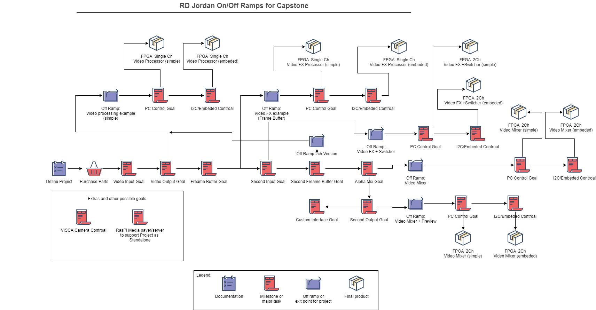{width="8.305319335083114in"
height="4.3256878827646545in"}
